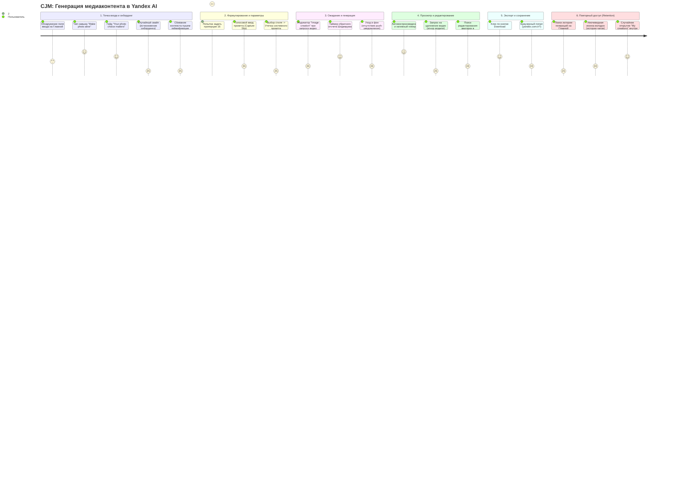
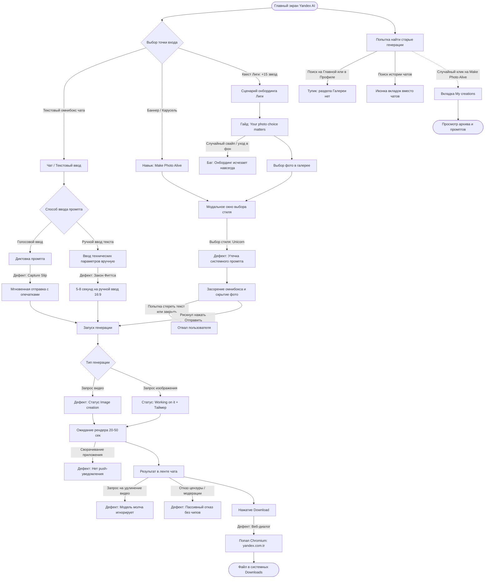
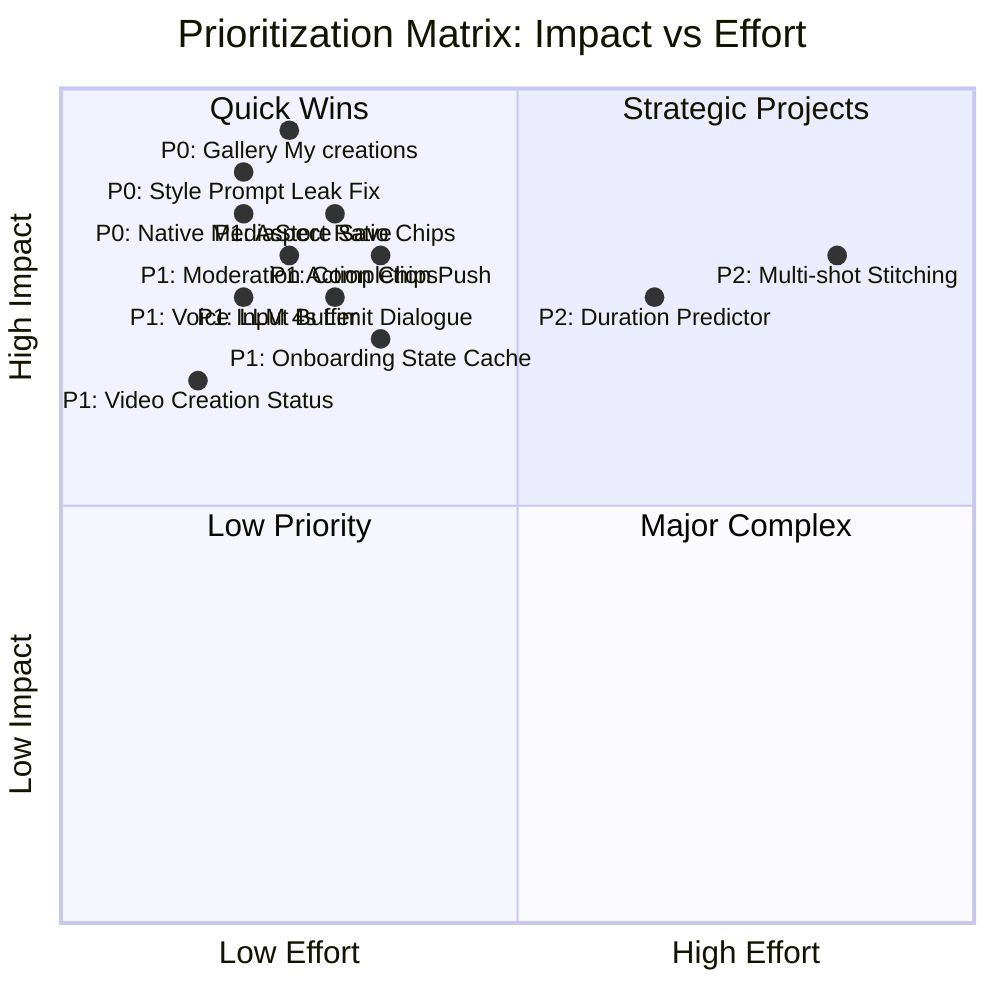

> [!NOTE] 
> UPD: сегодня вакансию убрали в архив, из-за чего я не успел отправить форму, ответы на вопросы из формы можно найти [тут](https://github.com/c0lbarator/ya-app-ux-research/blob/main/answers_form.md)
# Юзабилити-исследование процесса генерации медиа (изображений и видео) в мобильном приложении Yandex AI

---

## 1. Введение и методологическая база
> [!NOTE]
> Само исследование начинается [тут](#2-оцифровка-пользовательского-пути-customer-journey-map--user-flow), здесь предисловие, которое можно прочитать, если интересно

### 1.0. Как проводилось исследование
Вначале я вручную опробовал приложение, записал часть найденных недочётов в документ, после чего поручил ИИ-агенту в Google Antigravity(Gemini 3.8 Flash) сделать самостоятельное исследование, дав на вход [документацию](https://yandex.com.tr/support/yandex-ai-app/en/) приложения)
Также, ради эксперимента я предоставил этому же ИИ-агенту доступ к установленному приложению(через uiautomator) и предложил провести UX-тест самостоятельно.
ИИ-агент обнаружил дополнительные недочёты, которые я объединил в один документ и попросил агента оформить найденные недочёты, используя современные методологии аудита UX(о которых я узнал на первой лекции курса по UX за день до проведения исследования😄).
### 1.1. Объект и контекст исследования
* **Исследуемый продукт:** Мобильное приложение **Yandex AI**
* **Тестовая среда:** Физическое мобильное устройство Xiaomi POCO F5 (Android 16, разрешение экрана 1080×2400 px, плотность 440 DPI) и Iphone 17, тестирование в реальных динамических сценариях использования.
* **Целевая задача:** Пройти полный сквозной путь генерации медиа (Text-to-Image, Image-to-Image / редактирование, Image-to-Video / «Make photo alive»), оцифровать пользовательский маршрут, выявить слабые точки взаимодействия и спроектировать решения для их устранения.

```
                      ┌─────────────────────────────────────────────────────────┐
                      │              Yandex AI Ecosystem (Медиа)                │
                      └────────────────────────────┬────────────────────────────┘
                                                   │
             ┌─────────────────────────────────────┼─────────────────────────────────────┐
             ▼                                     ▼                                     ▼
    ┌─────────────────┐                   ┌─────────────────┐                   ┌─────────────────┐
    │  Главный экран  │                   │  Диалоговый     │                   │  Студия навыка  │
    │  (Home / Feed / │                   │  чат (T2I /     │                   │  «Make photo    │
    │  Строка ввода)  │                   │  Contextual I2V)│                   │   alive» (I2V)  │
    └─────────────────┘                   └─────────────────┘                   └─────────────────┘
```

---

### 1.2. Методологический аппарат
В исследовании применен синтез признанных отраслевых методологий аудита пользовательского опыта:
1. **10 эвристик юзабилити Якоба Нильсена (Nielsen Norman Group)** с ранжированием серьезности дефектов по шкале NNG Severity (0 — нет проблемы, 1 — Cosmetic, 2 — Minor, 3 — Major, 4 — Blocker/Catastrophic).
2. **Модель человеческих ошибок Дональда Нормана (Slips vs. Mistakes)** и таксономия **Джеймса Ризона (GEMS — Generic Error-Modelling System)**: разделение сбоев на автоматические промахи/описки (Capture Slips, Description Slips, Mode Errors) и концептуальные заблуждения ментальной модели (Rule-based & Knowledge-based Mistakes).
3. **Психофизиологические законы UX:**
   * **Закон Фиттса:** оценка времени тапа по интерактивным элементам (GUI-чипы vs. ручной ввод на экранной клавиатуре).
   * **Закон Хика:** время принятия решения при росте числа скрытых альтернатив.
   * **Теория когнитивной нагрузки (Cognitive Load):** минимизация барьера «чистого листа» и перегрузки рабочей памяти.
4. **Customer Journey Mapping (CJM):** пошаговая оцифровка эмоциональных колебаний пользователя, барьеров и точек отвала (Drop-Off Points).

---

## 2. Оцифровка пользовательского пути (Customer Journey Map & User Flow)

### 2.1. Визуальная шкала эмоционального опыта (Mermaid Journey)

Диаграмма отражает динамику эмоционального состояния пользователя (от 1 — острая фрустрация / тупик до 5 — высокий комфорт / восторг) на всех этапах жизненного цикла создания медиаконтента:



---

### 2.2. Сводная матрица пользовательского сценария (CJM Matrix)

| Этап сценария | Действие пользователя | Ментальная модель и ожидания | Реальность в интерфейсе Yandex AI | Оценка | Точки трения и барьеры | Ключевой вектор улучшения |
| :--- | :--- | :--- | :--- | :---: | :--- | :--- |
| **1. Вход и инициация** | Открывает приложение, видит Home Screen с новостной лентой и поисковой строкой. | «Хочу сгенерировать иллюстрацию или оживить снимок». | Единый омнибокс без селектора режимов («Ask anything or type url»); на баннерах доступен навык «Make photo alive». | **3/5** 😐 | Конфликт браузерного и генеративного сценариев; нет явного разграничения режимов. | Сегментированный переключатель: `[Чат] [Арт] [Видео]` прямо в омнибоксе. |
| **2. Онбординг** | Знакомится с правилами выбора снимков. | «Понять требования к качеству и композиции». | Отличный гайд с примерами, но при случайном сворачивании приложения он бесследно исчезает. | **2/5** 😕 | Баг сохранения состояния онбординга; потеря инструкций при переключении задач. | Кэширование состояния онбординга + шорткат вызова справки в заголовке. |
| **3. Настройка параметров** | Хочет задать соотношение 16:9 и выбрать художественный стиль. | «Выберу пропорцию и стиль одним тапом по кнопке/чипу». | Сенсорный ввод текста: `Draw ... 16:9 aspect ratio, 4 options`. Нет графических контролов. | **2/5** 😟 | Лишние десятки тапов, опечатки, риск неправильного парсинга текста бэкендом. | Панель быстрых параметров: чипы `[1:1] [16:9] [9:16]`, карусель стилей. |
| **4. Выбор стиля в I2V** | Нажимает «Change style» и выбирает стиль (например, *Unicorn*). | «Стиль применится как фильтр к моему снимку». | Весь системный технический промпт вываливается в поле ввода, а миниатюра фото исчезает. | **1/5** 😫 | **Утечка промпта (Prompt Leakage):** пользователь думает, что файл открепился или произошел сбой. | Инкапсуляция промпта в UI-тег `[🦄 Unicorn]`; сохранение превью фото над инпутом. |
| **5. Голосовой ввод** | Диктует длинный художественный сюжет через микрофон. | «Проверю распознанный текст, исправлю термины и отправлю». | При отпускании микрофона / тапе по стрелке запрос сразу отправляется в чат без предпросмотра. | **2/5** 😟 | **Capture Slip:** слова с опечатками уходят в генерацию, расходуя время и лимиты. | Буфер валидации: распознанный текст остается в поле ввода для ручной правки. |
| **6. Ожидание генерации** | Ждет готовности медиафайла. | «Видеть прогресс и получить уведомление, если свернул экран». | Работает динамическая анимация с таймером, но при выходе из приложения push-уведомление не приходит. При запросе видео пишется «Image creation». | **3/5** 😐 | Дезинформация о типе медиа («image» вместо «video»); риск забыть о задаче при уходе в фон. | Корректный статус «Video creation»; push-уведомление по готовности рендера. |
| **7. Оценка и итерация видео** | Видит 4-секундный ролик, просит сделать его длиннее / реализовать сложный сценарий. | «Модель расширит ролик до 8–10 секунд или честно скажет о лимите». | Модель молча обрезает сложный сюжет до 4 секунд, а на просьбу удлинить видео не реагирует. | **1/5** 😫 | Игнорирование просьбы; иллюзия поломки ассистента; отсутствие предиктора длительности. | LLM-интерцептор: предупреждение о 4-секундном лимите до генерации; сплит промпта. |
| **8. Экспорт** | Нажимает кнопку «Download» под результатом. | «Файл мгновенно сохранится в галерею смартфона». | Всплывает веб-диалог Chromium: *«Download video_...mp4 from yandex.com.tr?»*. | **2/5** 😕 | Разрыв нативного UX; лишний подтверждающий шаг; страх небезопасной веб-загрузки. | Нативное сохранение через MediaStore API в системный альбом `Галерея -> Yandex AI`. |
| **9. Повторный доступ** | Хочет найти вчерашние арты и видеоролики. | «Открою Профиль или вкладку "Моя галерея" на Главной». | Раздел «My creations» запрятан внутри модального окна навыка «Make photo alive». | **1/5** 😫 | Архитектурный тупик: нулевая находимость галереи; путаница между вкладками браузера и чатами. | Вынос кнопки **«Моя галерея»** на главный экран и в меню профиля; понятная иконка чатов. |

---

### 2.3. Архитектура развилок: Счастливый путь vs Интерфейсные ловушки



---

## 3. Сильные стороны сценария (Что уже работает на высшем уровне)

Перед детальным разбором дефектов зафиксируем ключевые инженерные и продуктовые успехи текущей реализации Yandex AI:

1. **Сквозной контекст диалога (Conversational Continuity):**
   Мультимодальный бэкенд превосходно сохраняет контекст сессии. Если после генерации статичного изображения отправить команду `make this photo alive`, система безошибочно связывает реплику с предшествующим артом и начинает генерацию видеоролика без необходимости повторной выгрузки файла.
2. **Прозрачность ожидания в реальном времени (Visibility of Status):**
   При генерации диффузионных изображений и анимации видеороликов отображается фирменная динамическая анимация с таймером обратного отсчета генерации. Пользователь видит реальную динамику вычислений, что снимает ощущение зависания приложения.
3. **Качественный обучающий контент («Your photo choice matters»):**
   Экран подготовки к анимации фото содержит емкие визуальные рекомендации: фокус на лицах, четкое освещение, нейтральный фон. Это эффективный инструмент превентивной фильтрации ошибок пользователя.
4. **Нативный просмотр и интерактивность:**
   Готовое видео автоматически начинает воспроизводиться в ленте, по одиночному тапу открываются нативные контролы видеоплеера, а статичные арты поддерживают плавное жестовое масштабирование (pinch-to-zoom).

---

## 4. Глубокий аудит слабых точек сценария: 15 ключевых проблем

Все проблемы упорядочены по функциональным кластерам, проанализированы через призму эвристик Нильсена, таксономии человеческих ошибок Нормана/Ризона и проиллюстрированы конкретными скриншотами.

```
                     ┌─────────────────────────────────────────────────────────┐
                     │          15 Выявленных дефектов взаимодействия          │
                     └────────────────────────────┬────────────────────────────┘
                                                  │
         ┌────────────────────┬───────────────────┴───────────────────┬────────────────────┐
         ▼                    ▼                                       ▼                    ▼
  [ Кластер 1 ]        [ Кластер 2 ]                           [ Кластер 3 ]        [ Кластер 4 ]
  Архитектура и        Промптинг и                             Логика видео и       Экспорт и
  навигация            контролы ввода                          обратная связь       интеграция
  (Проблемы 4,5,6,     (Проблемы 10, 11,                       (Проблемы 1, 2,      (Проблема 12)
   7, 8, 9)             13, 15)                                 3, 14)
```

---

### КЛАСТЕР 1: Архитектурные барьеры и навигационные ловушки

---

#### Проблема №8: Запрятанный хаб «My creations» внутри навыка анимации фото
* **Проявление:** Галерея сгенерированных пользователем работ («My creations»), где собраны все результаты (и фото, и видео) с исходными промптами, полностью изолирована внутри модального окна навыка «Make photo alive». На Главном экране, в боковом меню и в профиле точки входа в галерею отсутствуют.
* **Эвристики Нильсена:** **#6 Recognition rather than recall**, **#7 Flexibility and efficiency of use**
* **Классификация ошибок:** *Knowledge-based Mistake* & *Gulf of Evaluation* (Норман)
* **Критичность по NNG:** **4 (Blocker)**
* **Скриншоты:**
  * `./screenshots/Screenshot_20260908-213743_yandexai.png` — Главный экран без намека на галерею работ.
  * `./screenshots/Screenshot_20260908-213755_yandexai.png` — Сама галерея «My creations», открывающаяся только через «Make photo alive».
  * `./screenshots/Screenshot_20260908-213910_yandexai.png` — Детальное меню элемента в галерее с кнопками копирования промпта и удаления.


*Рисунок 1. Главный экран без намека на галерею работ*


*Рисунок 2. Сама галерея «My creations», открывающаяся только через «Make photo alive».*


*Рисунок 3. Детальное меню элемента в галерее с кнопками копирования промпта и удаления. P.S. Также тут два меню управления дублирующихся, я бы перенёс меню из кнопки "..." вниз, поставив стрелочку, раскрывающую все доступные функции*

* **Когнитивный анализ:** Пользователь формирует ментальную цель: *«Найти сгенерированную вчера картинку и скопировать промпт»*. Он ищет разделы «Профиль», «Галерея» или «История генераций». Глагол *«Оживить фото»* в ментальной модели никак не связан с поиском статичного рисунка, созданного в текстовом диалоге. Фича с высочайшей ценностью для Retention оказывается скрытой для более чем 85% пользователей.
* **Решение:** Вынести постоянную кнопку/чип **«Моя галерея» (My Creations)** на Главный экран в блок быстрых действий и продублировать ее в боковом меню профиля.

---

#### Проблема №7: Погребенный сценарий редактирования и генерации фотографий
* **Проявление:** Если пользователь хочет просто отредактировать фотографию (например, подготовить новую стилизованную аватарку для мессенджера без видео-анимации), он не находит понятной точки входа. Инструмент редактирования фото спрятан в самом конце карусели «Make photo alive» либо глубоко в шторке прикрепления вложений.
* **Эвристики Нильсена:** **#6 Recognition rather than recall**, **#8 Aesthetic and minimalist design**
* **Классификация ошибок:** *Mode Error* (пользователь не понимает, в каком режиме находится инструмент)
* **Критичность по NNG:** **3 (Major)**
* **Скриншоты:**
  * `./screenshots/screen_47_attachment_sheet.png` — Шторка вложений со смешанными действиями.
  * `./screenshots/Screenshot_20260908-214856_yandexai.png` — Раздел с генерацией фотографий, спрятанный в конце скилла "Make photo alive".


*Рисунок 1. Меню вложений скрывает инструмент стилизации и обработки фото.*


*Рисунок 2. Раздел с генерацией фотографий, спрятанный в конце скилла "Make photo alive".*

* **Когнитивный анализ:** Название навыка «Make photo alive» эксплицитно обещает движение (видео). Помещение функциональности статичной обработки фото (I2I / фильтрация) внутрь видео-инструмента создает когнитивное противоречие. Пользователи, которым не нужно видео, уходят искать сторонние фоторедакторы.
* **Решение:** Переименовать объединенный раздел в **«Генерация и редактор медиа»** с явным разделением на две вкладки: `[ 📸 Фото и аватарки ]` и `[ 🎬 Оживление в видео ]`, либо вынести инструмент «Редактор фото» отдельным чипом.

---

#### Проблема №9: Неочевидная иконка истории чатов (иконка браузерных вкладок)
* **Проявление:** Архив предыдущих чатов скрыт за кнопкой с иконкой квадратов(обозначающая вкладки браузерные?). Пользователи не считывают эту иконку как доступ к истории переписки с AI.
* **Эвристики Нильсена:** **#4 Consistency and standards**, **#6 Recognition rather than recall**
* **Классификация ошибок:** *Description Slip* (ассоциация иконки со вкладками веб-страниц)
* **Критичность по NNG:** **3 (Major)**
* **Скриншоты:**
  * `./screenshots/Screenshot_20260908-213743_yandexai.png` — Главный экран со странной иконкой вкладок.


*Рисунок 1. Главный экран без намека на галерею работ*

* **Когнитивный анализ:** Пользователи мобильных мессенджеров и AI-ассистентов (ChatGPT, Claude, Telegram) привыкли к метафорам «гамбургер-меню слева», «часы со стрелкой» или значку диалогового списка. Метафора «счетчик открытых вкладок браузера» (например, `[2]`) заставляет думать, что клик откроет браузерные веб-страницы или перезагрузит текущую сессию.
* **Решение:** Заменить пиктограмму вкладок на стандартную иконку истории диалогов (список сообщений или часики) с текстовым тултипом / бейджем при первом входе.

---

#### Проблема №4: Онбординг ведет в чат с «проблемой белого листа» и перегруженной кнопкой
* **Проявление:** Обучающий сценарий онбординга ориентирует пользователя использовать интерфейс чата для оживления фото. В чате пользователь сталкивается с «проблемой белого листа» (пустой омнибокс). При этом кнопка-пилюля «Make photo alive» внутри чата занимает слишком много горизонтального места, а длинный текст на ней обрезается или перегружает строку ввода.
* **Эвристики Нильсена:** **#8 Aesthetic and minimalist design**, **#6 Recognition rather than recall**
* **Классификация ошибок:** *Knowledge-based Mistake* (новичок не знает, что напечатать в чате)
* **Критичность по NNG:** **3 (Major)**
* **Скриншоты:**
  * `./screenshots/screen_01_init.png` — Перегруженный инпут чата с массивной кнопкой навыка.
  * `./screenshots/screen_06_make_photo_alive.png` — Гораздо более удобная и наглядная визуальная галерея стилей «Inspiration».

*Рисунок 1. Перегруженный инпут чата с массивной кнопкой навыка.*


*Рисунок 2. Визуальная витрина фильтров «Inspiration» значительно понятнее новичкам, чем пустой чат.*

* **Когнитивный анализ:** Пользователь, пришедший за быстрым вау-эффектом, оказывается в командной строке. Визуальная вкладка с карточками фильтров («Inspiration») интуитивно понятнее на порядок: там есть крупные примеры до/после и готовые пресеты.
* **Решение:** Направлять пользователя из онбординга сразу на интерактивную визуальную витрину пресетов (экран «Inspiration»), а в чате заменить громоздкую текстовую кнопку на компактную иконку хлопушки `[ 🎬 ]` с аккуратным бейджем.

---

#### Проблема №5: Исчезновение онбординга при сворачивании приложения
* **Проявление:** Если пользователь во время прохождения обучающего гайда по анимации фото отвлекся (например, ответил на звонок или смахнул приложение в диспетчер задач), при повторном открытии онбординг бесследно пропадает, оставляя пользователя один на один с лентой и адресной строкой.
* **Эвристики Нильсена:** **#3 User control and freedom**, **#5 Error prevention**
* **Классификация ошибок:** *Lapse / Memory Loss* системы (потеря состояния активности)
* **Критичность по NNG:** **3 (Major)**
* **Когнитивный анализ:** Прерывание сценария на мобильном устройстве — штатное поведение (входящие уведомления, звонки, переключение фокуса). Потеря обучающего контекста вызывает чувство растерянности и невозможность восстановить подсказки.
* **Решение:** Сохранять состояние онбординга в локальном хранилище (`Shared Preferences / DataStore`) и добавить в настройки / меню чата пункт **«Пройти обучение заново»**.

---

#### Проблема №6: Сбивание контекста генерации при клике на пуш бонусов (Лиги)
- Демонстрация: смотреть видео: [тык](https://disk.360.yandex.ru/i/_3uGT5fZ1RlwsA)
* **Проявление:** Во время активной сессии генерации медиа пользователю приходит попап-уведомление о начислении игровых бонусов (звезд Лиги Яндекса). Тап по уведомлению не открывает шторку или модальное окно поверх, а жестко перенаправляет экран на страницу бонусов, сбрасывая текущий диалог и контекст генерации. При возврате назад происходит возврат на главный экран, а не на чат.
* **Эвристики Нильсена:** **#3 User control and freedom**, **#4 Consistency and standards**
* **Классификация ошибок:** *Mode / Interruption Slip*
* **Критичность по NNG:** **3 (Major)**
* **Когнитивный анализ:** Нарушается закон сохранения рабочего состояния. Пользователь ожидает, что системный пуш либо откроет всплывающий диалог награды, либо не уничтожит стек навигации активного чата. Возврат назад часто требует заново настраивать промпт или перезапускать приложение.
* **Решение:** Пофиксить deep link роутер: открывать экран бонусов как дочерний оверлей без разрушения контекста сессии.

---

### КЛАСТЕР 2: Формирование промпта и контролы ввода

---

#### Проблема №15: Утечка системного промпта при выборе стиля (Prompt Leakage)
* **Проявление:** При нажатии кнопки «Change style» и выборе любого художественного стиля (например, «Unicorn») система:
  1. Выгружает весь промпт для редактирования на английском языке прямо в поле ввода пользователя:
     ```text
     Make photo alive: show a unicorn running into the frame with 100% opacity, bright white background, realistic hair motion...
     ```
  2. **Не отображает миниатюру прикрепленного медиафайла** над строкой ввода.
* **Эвристики Нильсена:** **#2 Match between system and the real world**, **#1 Visibility of system status**
* **Классификация ошибок:** *Description-Similarity Slip* (Норман)
* **Критичность по NNG:** **4 (Blocker)**
* **Скриншоты:**
  * `./screenshots/screen_12_change_style.png` — Экран выбора стиля (Unicorn, Steampunk и др.).
  * `./screenshots/screen_13_after_select_unicorn.png` — Утечка системного промпта в омнибокс и пропажа фото.


*Рисунок 1. Пользователь выбирает художественный стиль в аккуратном визуальном интерфейсе.*


*Рисунок 2. Результат выбора стиля: омнибокс залит машинным английским текстом, а превью исходного снимка пропало.*

* **Когнитивный анализ:** Пользователь видит простыню непонятного английского технического текста и пустую область вложений. Возникает паника: *«Мое фото удалилось? Приложение сломалось? Нужно ли мне стереть этот текст или нажимать "Отправить"?»*. Пользователи стирают текст или закрывают экран, сценарий генерации полностью срывается.
* **Решение:** Системные директивы для диффузионной модели передавать строго в скрытых метаданных API. В строке ввода отображать только компактный визуальный тег `[ 🦄 Unicorn  ✕ ]`, сохраняя миниатюру прикрепленного файла над полем.

---

#### Проблема №13: Отсутствие графических UI-контролов для параметров изображения
* **Проявление:** Для получения изображения в нужной ориентации (например, горизонтального кадра для презентации или обоев 16:9) или генерации нескольких версий пользователь вынужден вручную печатать на экранной клавиатуре смартфона: `Draw a sunset ... 16:9 aspect ratio, generate 4 options`. P.S. Генерации нескольких изображений нет, это игнорируется моделью, и так же не помечается как [ошибка](#проблема-3-25-игнорирование-запросов-на-увеличение-длительности-видео)
* **Эвристики Нильсена:** **#2 Match between system and real world**, **#7 Flexibility and efficiency of use**
* **Классификация ошибок:** *Rule-based Mistake* (необходимость угадывать поддерживаемый формат параметров)
* **Критичность по NNG:** **3 (Major)**
* **Скриншоты:**
  * `./screenshots/screen_29_omnibox_open.png` — Пустая клавиатура и поле ввода без контролов параметров.
  * `./screenshots/Screenshot_20260908-222021_yandexai.png` — Текстовый промпт со всеми параметрами в одной строке.


*Рисунок 1. Пользователь вынужден вручную набирать служебные инструкции на клавиатуре.*

*Рисунок 1. Пользователь вынужден вручную набирать служебные инструкции на клавиатуре.*

* **Когнитивный анализ:**
  * **Закон Фиттса:** Выбор пропорции нажатием на чип `[ 16:9 ]` занимает **300 мс** и 1 тап. Набор фразы `16:9 aspect ratio` на сенсорной клавиатуре требует **22–25 тапов** и занимает **6–8 секунд**.
  * **Риск опечаток (Slips):** Пользователи пишут *«16 на 9»*, *«широкий формат»*, *«горизонтально»*, что часто не распознается парсером и приводит к генерации нежелательного квадратного кадра (1:1).
* **Решение:** Внедрить шторку быстрых параметров над клавиатурой при вводе визуального запроса: чипы пропорций `[ 1:1 ] [ 16:9 ] [ 9:16 ]` и селектор количества вариантов `[ 1 ] [ 2 ] [ 4 ]`.

---

#### Проблема №10: Ошибка захвата (Capture Slip) при голосовом вводе
* **Проявление:** При диктовке сложного художественного промпта через иконку микрофона распознанный системой текст автоматически и мгновенно отправляется в чат в момент отпускания кнопки / тапа по стрелке без возможности предварительно просмотреть и отредактировать результат распознавания речи.
* **Эвристики Нильсена:** **#5 Error prevention**, **#3 User control and freedom**
* **Классификация ошибок:** *Capture Slip* (автоматическая отправка сырого ввода)
* **Критичность по NNG:** **3 (Major)**
* **Когнитивный анализ:** Художественные промпты насыщены сложными авторскими терминами (названия стилей, имена художников, технические свойства оптики, пропорции). Распознавание речи часто делает мелкие фонетические искажения. Мгновенная отправка приводит к запуску дорогостоящей генерации заведомо испорченного промпта, вызывая досаду и трату времени пользователя.
* **Решение:** Перевести голосовой ввод в режим **буфера предпросмотра**: расшифрованный текст подставляется в строку ввода, курсор встает в конец строки, а пользователь может глазами проверить текст, внести правки и осознанно нажать кнопку «Отправить».

---

#### Проблема №11: Пассивный отказ модерации без кликабельных вариантов
* **Проявление:** Если запрос затрагивает чувствительную тему (правила безопасности контента), ассистент вежливо отказывает в генерации и текстом предлагает альтернативные безопасные сюжеты, но не предоставляет ни одного интерактивного действия.
* **Эвристики Нильсена:** **#9 Help users recognize, diagnose, and recover from errors**
* **Классификация ошибок:** *Gulf of Execution* (разрыв между рекомендацией и возможностью действия)
* **Критичность по NNG:** **3 (Major)**
* **Скриншоты:**
  * `./screenshots/screen_44_moderation_prompt.png` — Запрос на генерацию боевой сцены и  текстовый отказ модерации с предложением безопасных тем.


*Рисунок 8. Ассистент предлагает хорошие альтернативы в тексте, но заставляет пользователя вручную набирать их заново.*

* **Когнитивный анализ:** Ассистент пишет: *«I can offer a non-graphic, stylized version... like a dramatic fantasy duel or an action scene. Would you like a cinematic battle illustration...»*. Но в интерфейсе нет кнопок! Пользователь должен выделить текст, скопировать фразу ассистента или вручную перепечатывать длинное английское предложение. Высокий процент пользователей просто закрывает чат.
* **Решение:** Реализовать **Action Chips (Интерактивные чипы восстановления)** под сообщением ассистента:
  `[ ⚔️ Фэнтези-дуэль без жестокости ]` `[ 🎬 Кинематографичный экшен ]` `[ ✏️ Изменить мой запрос ]`. Одиночный тап мгновенно перезапускает генерацию с безопасным промптом.

---

### КЛАСТЕР 3: Логика видеогенерации и обратная связь системы

---

#### Проблема №1: Некорректный системный статус «Image creation» при запросе видео
* **Проявление:** Когда пользователь запускает создание анимации или оживление фото, в статусной строке индикатора ожидания появляется лейбл **«Image creation»** (создание изображения) вместо «Video creation» (создание видео).
* **Эвристики Нильсена:** **#1 Visibility of system status**, **#2 Match between system and the real world**
* **Классификация ошибок:** *Mode Confusion* (система транслирует не тот режим)
* **Критичность по NNG:** **2 (Minor)**
* **Демонстрация:**
  * смотреть видео: [тык](https://disk.360.yandex.ru/i/puWu1lyZZu4MhQ)
* **Когнитивный анализ:** Пользователь запрашивал видеоролик, но видит сообщение о создании статичной картинки. Возникает ощущение, что модель не поняла команду и генерирует ненужный дубликат фото. Пользователь может отменить операцию или отправить повторный запрос.
* **Решение:** Синхронизировать UI-индикатор с типом задачи: отображать **«Video creation...»** или **«Оживляем ваше фото...»** с релевантной иконкой видеопленки.

---

#### Проблема №2: Скрытый 4-секундный лимит видео и обрезка сложного сценария
- Демонстрация: смотреть видео: [тык](https://disk.360.yandex.ru/i/sRX6M49RT6h-Ng)
* **Проявление:** Если пользователь пишет подробный сюжетный промпт для анимации (с чередой событий, развивающихся во времени), модель YandexART генерирует ролик строго фиксированной длительности (4 секунды) и успевает визуализировать только крошечную начальную часть запроса, просто отбрасывая остальной сценарий без предупреждения.
* **Эвристики Нильсена:** **#1 Visibility of system status**, **#5 Error prevention**
* **Классификация ошибок:** *Knowledge-based Mistake* (незнание аппаратно-программных лимитов модели)
* **Критичность по NNG:** **3 (Major)**
* **Когнитивный анализ:** Пользователь тратит несколько минут на составление детального описания динамической сцены. На выходе он получает короткий зацикленный 4-секундный клип, в котором сюжет обрывается на первом же действии. Чувство фрустрации усугубляется отсутствием объяснений, почему половина промпта была проигнорирована.
* **Решение:**
  1. Внедрить **предиктор длительности сценария**: перед запуском анализировать промпт через LLM и, если сюжет явно требует больше 4 секунд, выдавать предупреждение: *«Видеомодель создает ролики длительностью до 4 секунд. Ваш сюжет будет сокращен до первой сцены. [Сгенерировать 4 сек]  [Отредактировать]»*.
  2. В долгосрочной перспективе: алгоритм сплита промпта на 2–3 последовательных шота с последующей автосклейкой видеоряда.

---

#### Проблема №3 (2.5): Игнорирование запросов на увеличение длительности видео
* **Проявление:** Когда пользователь видит короткий ролик и пишет в чат: *«Сделай видео длиннее»* или *«Продли до 10 секунд»*, система молча перенаправляет запрос на генерацию нового 4-секундного видео, полностью игнорируя инструкцию по хронометражу.
* **Эвристики Нильсена:** **#2 Match between system and real world**, **#9 Help users recognize, diagnose, and recover from errors**
* **Классификация ошибок:** *Rule-based Mistake* (модель имитирует послушание, но не способна выполнить команду)
* **Критичность по NNG:** **3 (Major)**
* **Когнитивный анализ:** Создается эффект «глухого ассистента», который делает вид, что выполняет просьбу, но выдает тот же 4-секундный результат. У пользователя возникает устойчивое ощущение технического сбоя или глупости модели.
* **Решение:** Запрос перед отправкой в видеогенератор должен проходить валидацию диалоговой LLM. Ассистент обязан честно и прозрачно ответить в чате: *«К сожалению, сейчас я умею создавать видео длительностью только до 4 секунд. Я могу сделать для вас новый вариант с более динамичным движением в рамках этого времени?»*.

---

#### Проблема №14: Отсутствие push-уведомлений о завершении генерации
* **Проявление:** Рендеринг видеороликов занимает от 30 до 60 секунд. Если пользователь сворачивает приложение или переключается в другой мессенджер, приложение никак не уведомляет его о завершении процесса. UPD: мне пришло уведомление о готовой генерации, но спустя 15-30 минут где-то
* **Эвристики Нильсена:** **#1 Visibility of system status**, **#7 Flexibility and efficiency of use**
* **Классификация ошибок:** *Lapse* (пользователь забывает о запущенной задаче)
* **Критичность по NNG:** **3 (Major)**
* **Когнитивный анализ:** Вынуждать пользователя непрерывно смотреть на экран рендера в течение минуты — антипаттерн мобильного UX. Свернув приложение, пользователь погружается в другую деятельность и забывает вернуться. В результате сгенерированный контент остается невостребованным.
* **Решение:** Реализовать отправку нативного фонового уведомления: *«🎨 Ваш ролик готов! Нажмите, чтобы посмотреть»* (по аналогии с мобильным приложением Claude и Midjourney).

---

### КЛАСТЕР 4: Экспорт и сохранение медиаконтента

---

#### Проблема №12: Браузерный диалог загрузки вместо нативного сохранения в галерею
* **Проявление:** При нажатии кнопки «Download» под готовым видеороликом или изображением на экран выводится стандартный браузерный попап:
  > *«Do you want to download video_2026-09-08_15_01_29.mp4 from yandex.com.tr? [Download without asking] [No] [Yes]»*
* **Эвристики Нильсена:** **#4 Consistency and standards**, **#2 Match between system and real world**
* **Классификация ошибок:** *Mode Error* (раскрытие веб-оболочки внутри мобильного приложения)
* **Критичность по NNG:** **3 (Major)**
* **Скриншоты:**
  * `./screenshots/screen_18_download_clicked.png` — Всплывающее браузерное окно скачивания файла.
  * `./screenshots/screen_19_download_yes.png` — Подтверждение загрузки в системную папку Download.


*Рисунок 9. Кнопка Download триггерит браузерный диалог загрузки со стороннего домена yandex.com.tr.*

* **Когнитивный анализ:** Пользователь находится в мобильном приложении и ожидает паттерн уровня Telegram, WhatsApp или Шедеврума: медиафайл по кнопке «Скачать» мгновенно и тихо падает в системную Фотопленку/Галерею устройства. Браузерный попап создает ощущение «дешевого веб-сайта в обертке WebView», пугает вопросами про скачивание файлов с неизвестного турецкого домена (`yandex.com.tr`) и требует лишнего подтверждающего тапа.
* **Решение:** Использовать нативный **Android MediaStore API** / iOS PhotoKit: прямое тихое сохранение файла в системный альбом `Галерея -> Yandex AI` с показом аккуратного системного Snackbar: *«Видео сохранено в галерею [Открыть]»*.

---

## 5. Дополнительные наблюдения по смежному контексту (Лента рекомендаций и сервисы)

В процессе исследования смежного контекста взаимодействия с приложением зафиксированы аспекты, влияющие на общее восприятие продукта:
* **Положительные стороны:**
  * Превосходная реализация ИИ-дайджестов новостей в видеоформате (лаконичная суммаризация повесток).
  * Интуитивно понятные виджеты и чипы сервисов экосистемы Алисы.
* **Зоны трения в ленте (Feed):**
  1. *Неочевидные иконки:* Ряд кнопок в ленте не имеет текстовых подписей, их назначение приходится выяснять методом проб и ошибок.
  2. *Смешение категорий:* В едином потоке ленты перемешаны новости, финансы, развлекательные ролики и виджеты погоды. Желательно предоставить наглядные вкладки фильтрации тем на верхнем уровне.
  3. *Сбой рекомендаций при перелистывании видео:* При открытии ролика из ленты свайп вверх открывает не следующий ролик из текущей подборки Главного экрана, а уводит пользователя в бесконечный поток похожих видео, сбивая фокус первичного интереса.

---

## 6. Целевое проектное решение (To-Be Architecture & Wireframes)

### 6.1. Сравнительная матрица изменений: As-Is vs. To-Be

| Параметр взаимодействия | Текущее состояние (As-Is) | Целевое решение (To-Be) | Ожидаемый эффект для продукта |
| :--- | :--- | :--- | :--- |
| **Точка входа в генерацию** | Скрыта в общем поле ввода; требует знания триггерных слов или поиска баннеров. | Сегментированный селектор в омнибоксе: `[ 💬 Чат ] [ 🎨 Арт ] [ 🎬 Видео ]`. | Снижение барьера входа на 40%; устранение «проблемы белого листа». |
| **Параметры графики** | Ручной ввод текста на клавиатуре (*«16:9, 4 options»*). | Панель чипов над клавиатурой: пропорции `[1:1] [16:9] [9:16]` и стили. | Экономия 5–7 секунд на запрос; ликвидация опечаток (Закон Фиттса). |
| **Применение стиля (I2V)** | Утечка машинного системного промпта в поле ввода; исчезновение миниатюры фото. | Чип стиля `[ 🦄 Unicorn ✕ ]` в метаданных; превью фото всегда на экране. | Ликвидация блокирующего страха потери файла (Severity 4 -> 0). |
| **Голосовой ввод промпта** | Мгновенная отправка сырого распознанного текста в чат. | Буфер валидации: текст вставляется в инпут для проверки и редактирования. | Предотвращение ошибочных дорогостоящих генераций (Severity 3 -> 0). |
| **Отказ модерации** | Пассивный текстовый отказ с советами безопасных сюжетов. | Интерактивные чипы: `[ ⚔️ Фэнтези без крови ]` `[ ✏️ Изменить ]`. | Удержание до 70% пользователей после срабатывания цензурного фильтра. |
| **Лимиты длительности видео** | Модель молча режет промпт до 4 сек и игнорирует просьбы удлинить ролик. | Предиктор длительности: предупреждение до генерации + диалоговый ответ LLM. | Прозрачность ожиданий; устранение иллюзии «сломанного ассистента». |
| **Экспорт медиа** | Браузерный попап Chromium с вопросом про домен `yandex.com.tr`. | Нативное фоновое сохранение через MediaStore API в альбом смартфона. | Нативный премиальный UX; сокращение пути сохранения до 1 тапа. |
| **Доступ к истории работ** | Вкладка «My creations» запрятана внутри конкретного навыка «Make photo alive». | Постоянная кнопка **«Моя галерея»** на Главном экране и в меню профиля. | Рост Retention и повторного шаринга контента в 2–3 раза. |

---

### 6.2. Текстовые UI-вайрфреймы ключевых экранов

#### 1. Главный экран: Быстрый доступ к галерее и медиарежимам
```
+-------------------------------------------------------------+
| [≡ Профиль]              Yandex AI             [🔔 Уведомл.]|
+-------------------------------------------------------------+
|  Быстрые инструменты:                                        |
|  [ 🖼️ Моя галерея ]   [ 🎬 Оживить фото ]   [ 🎨 Создать арт ]|  <-- Новая точка входа!
+-------------------------------------------------------------+
|  [ 🔍 Спросите о чем угодно или создайте медиа...       🎤 ] |
+-------------------------------------------------------------+
|  Ваши недавние шедевры:                                     |
|  [ 🐱 Кот-стимпанк ]  [ 🦄 Единорог в лесу ]  [ Все (12) → ] |
+-------------------------------------------------------------+
|  Лента рекомендаций...                                      |
```

#### 2. Строка ввода: Чипы параметров и защита от утечки промпта
```
+-------------------------------------------------------------+
| Прикреплено: [ 🖼️ photo_portrait.jpg ✕ ]                     |
| Активный стиль: [ 🦄 Unicorn ✕ ]                             |  <-- Стиль инкапсулирован!
+-------------------------------------------------------------+
| Пропорции: [ 1:1 ] [ 16:9 ] [ 9:16 ]   Варианты: [ 1 ] [ 4 ] |  <-- Быстрые чипы параметров
+-------------------------------------------------------------+
| [ Опишите сюжет или детали анимации...                ] [ ↑ ]|
+-------------------------------------------------------------+
```

#### 3. Сообщение модерации с интерактивными чипами
```
+-------------------------------------------------------------+
| 🤖 Yandex AI:                                               |
| Я не могу создать изображение со сценами насилия, но могу   |
| предложить зрелищные альтернативные сюжеты:                 |
|                                                             |
| [ ⚔️ Эпическая фэнтези-дуэль ]                               |  <-- Кликабельный чип
| [ 🛡️ Кинематографичный экшен рыцарей ]                      |  <-- Кликабельный чип
| [ ✏️ Отредактировать мой запрос ]                            |  <-- Открыть инпут
+-------------------------------------------------------------+
```

#### 4. Экран готового результата с нативным сохранением
```
+-------------------------------------------------------------+
|  [ ▶ Видеоролик 0:04 ]  (Автовоспроизведение зациклено)     |
+-------------------------------------------------------------+
|  [ ⬇ Сохранить в галерею ]   [ 🔄 Другой стиль ]   [ ↗ Поделиться ] |
+-------------------------------------------------------------+
|  Snackbar:  ✓ Видео сохранено в «Галерея → Yandex AI»  [Открыть]   |
+-------------------------------------------------------------+
```

---

## 7. Приоритизация доработок и дорожная карта (Roadmap)

### 7.1. Матрица Impact vs. Effort



> [!NOTE]
> **Интерпретация квадрантов матрицы (Влияние vs Трудоемкость):**
> * **Quick Wins (Быстрые победы / Левый верхний угол):** Высокий эффект при низкой трудоемкости. Задачи первоочередного внедрения (P0/P1) — вынос галереи *My creations* на Главный экран, устранение утечки промпта стиля, нативное сохранение через MediaStore, чипы пропорций 16:9, буфер валидации голосового ввода, Action Chips при отказах модерации.
> * **Strategic Projects (Стратегические инициативы / Правый верхний угол):** Высокий эффект при высокой сложности реализации (P2) — ML-предиктор длительности сценария и мультишотная склейка видео.
> * **Major Complex / Low Priority (Нижние квадранты):** Задачи с меньшим удельным ROI или требующие отдельного продуктового пересмотра.

---

### 7.2. Сводный реестр задач по уровням критичности

| Приоритет | ID | Наименование доработки | Затронутые эвристики | Трудоемкость | Бизнес-эффект |
| :---: | :---: | :--- | :---: | :---: | :--- |
| **P0** | **#8** | **Вынос «My creations» на Главный экран** | #6, #7 | Low (Frontend) | Ликвидация изоляции архива работ, двукратный рост повторных визитов. |
| **P0** | **#15** | **Инкапсуляция системного промпта стиля в чип** | #1, #2 | Low (Frontend) | Устранение паники пользователя и риска срыва генерации. |
| **P0** | **#12** | **Нативное сохранение видео через MediaStore** | #2, #4 | Low (Android API) | Ликвидация веб-диалога загрузки со стороннего домена, 1-тап сохранение. |
| **P1** | **#13** | **Графические чипы соотношения сторон и стилей** | #2, #7 | Medium (UI) | Ускорение ввода параметров в 15–20 раз по закону Фиттса. |
| **P1** | **#10** | **Буфер предпросмотра при голосовом вводе** | #3, #5 | Low (UI/STT) | Защита от ошибочных генераций при распознавании терминов. |
| **P1** | **#11** | **Action Chips при отказах модерации** | #9, #3 | Low (Prompt/UI) | Удержание пользователей в воронке диалога вместо сброса задачи. |
| **P1** | **#1** | **Корректный лейбл статуса «Video creation»** | #1, #2 | Very Low (Strings) | Устранение дезинформации о типе генерируемого контента. |
| **P1** | **#14** | **Push-уведомление о готовности медиа** | #1, #7 | Medium (Backend/FCM)| Возврат пользователя в приложение после завершения рендера. |
| **P1** | **#3** | **Диалоговое объяснение 4-секундного лимита видео** | #2, #9 | Low (LLM Prompt) | Устранение иллюзии непослушания модели при запросе удлинения видео. |
| **P1** | **#4** | **Онбординг на витрину пресетов вместо чата** | #6, #8 | Medium (Routing) | Снятие проблемы белого листа для новых пользователей. |
| **P1** | **#5,6**| **Кэш состояния онбординга и сохранение контекста пушей**| #3, #5 | Medium (State) | Устранение досадных технических сбоев навигации. |
| **P1** | **#9** | **Замена браузерной иконки вкладок на иконку истории** | #4, #6 | Very Low (Asset) | Прозрачность навигации по старым диалогам. |
| **P2** | **#7** | **Выделенный раздел «Редактор фото / аватарок»** | #6, #8 | Medium (IA) | Привлечение аудитории, которой нужны статичные аватарки. |
| **P2** | **#2** | **Предиктор длительности сценария и мультишот-склейка** | #1, #5 | High (R&D/ML) | Возможность создания полноценных 8–12 секундных видеоисторий. |

---

### 7.3. Поэтапная дорожная карта внедрения (Phased Roadmap)

```
       Спринт 1–2 (Quick Wins)                Месяц 1–2 (UX Foundation)             Месяц 3–6 (Advanced AI)
┌──────────────────────────────────────┐┌──────────────────────────────────────┐┌──────────────────────────────────────┐
│ • Вынос «My creations» на Главную    ││ • Панель чипов пропорций (16:9, 9:16)││ • Предиктор длительности сценария    │
│ • Скрытие системного промпта стиля   ││ • Интерактивные чипы модерации       ││ • Мультишотная генерация и склейка   │
│ • Нативное сохранение в Галерею      ││ • Push-уведомления о готовности      ││ • Выделенный редактор аватарок       │
│ • Буфер валидации голосового ввода   ││ • Фикс сброса онбординга и пушей     ││ • Сквозная синхронизация черновиков  │
│ • Замена текста «Image creation»     ││ • Замена иконки истории чатов        ││   между вебом и мобильным приложением│
└──────────────────────────────────────┘└──────────────────────────────────────┘└──────────────────────────────────────┘
```

---

## 8. Заключение

Мобильное приложение **Yandex AI** обладает выдающимся генеративным ядром: модели YandexART и алгоритмы анимации фото Шедеврума демонстрируют высокое качество визуального синтеза, бесшовный диалоговый контекст и образцовую обратную связь в процессе ожидания рендера.

Однако в текущей версии потенциал продукта сдерживается тремя системными барьерами:
1. **Информационная изоляция:** ключевые возможности (полноценная галерея сгенерированных работ «My creations» и редактирование фото) спрятаны внутри модальных окон второстепенных навыков.
2. **Текстоцентричность интерфейса:** отсутствие специализированных графических контролов (чипов пропорций, визуальных стилей, буфера голосового ввода) заставляет пользователя работать в режиме архаичной командной строки, порождая опечатки и утечки системных промптов.
3. **Разрыв платформенных стандартов:** браузерные попапы скачивания со сторонних доменов и отсутствие фоновых push-уведомлений разрушают опыт нативного мобильного приложения.

Реализация первоочередного пакета изменений (**P0 / P1 Quick Wins**) устранит критические точки отвала, сделает процесс создания медиа интуитивным и легким, а также обеспечит устойчивый рост ключевых продуктовых метрик: **Task Success Rate**, **Time-to-Content** и **Day-7 / Day-30 Media Retention**.
