> [!NOTE] 
> UPD: форма странно отправилась, если каких-то данных в форме не хватает, то их можно найти тут [тут](https://github.com/c0lbarator/ya-app-ux-research/blob/main/answers_form.md)
# Юзабилити-исследование процесса генерации медиа (изображений и видео) в мобильном приложении Yandex AI

---

## 1. Введение и методологическая база
> [!NOTE]
> Само исследование начинается [тут](#2-оцифровка-пользовательского-пути-customer-journey-map--user-flow), здесь предисловие, которое можно прочитать, если интересно

### 1.0. Как проводилось исследование
Вначале я вручную опробовал приложение, записал часть найденных недочётов в документ, после чего поручил ИИ-агенту в Google Antigravity(Gemini 3.8 Flash) сделать самостоятельное исследование, дав на вход [документацию](https://yandex.com.tr/support/yandex-ai-app/en/) приложения)
Также, ради эксперимента я предоставил этому же ИИ-агенту доступ к установленному приложению(через uiautomator) и предложил провести UX-тест самостоятельно.
ИИ-агент обнаружил дополнительные недочёты, которые я объединил в один документ и попросил агента оформить найденные недочёты, используя современные методологии аудита UX(о которых я узнал на первой лекции курса по UX за день до проведения исследования😄).
### 1.1. Объект и контекст исследования
* **Исследуемый продукт:** Мобильное приложение **Yandex AI**
* **Тестовая среда:** Физическое мобильное устройство Xiaomi POCO F5 (Android 16, разрешение экрана 1080×2400 px, плотность 440 DPI) и iPhone 17, тестирование в реальных условиях использования.
* **Целевая задача:** Пройти полный сквозной путь генерации медиа (Text-to-Image, Image-to-Image / редактирование, Image-to-Video / «Make photo alive»), оцифровать пользовательский маршрут, выявить слабые точки взаимодействия и спроектировать решения для их устранения.

```
                      ┌─────────────────────────────────────────────────────────┐
                      │              Yandex AI Ecosystem (Медиа)                │
                      └────────────────────────────┬────────────────────────────┘
                                                   │
             ┌─────────────────────────────────────┼─────────────────────────────────────┐
             ▼                                     ▼                                     ▼
    ┌─────────────────┐                   ┌─────────────────┐                   ┌─────────────────┐
    │  Главный экран  │                   │  Диалоговый     │                   │  Студия навыка  │
    │  (Home / Feed / │                   │  чат (T2I /     │                   │  «Make photo    │
    │  Строка ввода)  │                   │  Contextual I2V)│                   │   alive» (I2V)  │
    └─────────────────┘                   └─────────────────┘                   └─────────────────┘
```

---

### 1.2. Методологический аппарат
В исследовании применен синтез признанных отраслевых методологий аудита пользовательского опыта:
1. **10 эвристик юзабилити Якоба Нильсена (Nielsen Norman Group)** с ранжированием серьезности дефектов по шкале NNG Severity (0 — нет проблемы, 1 — Cosmetic, 2 — Minor, 3 — Major, 4 — Blocker/Catastrophic).
2. **Модель человеческих ошибок Дональда Нормана (Slips vs. Mistakes)** и таксономия **Джеймса Ризона (GEMS — Generic Error-Modelling System)**: разделение сбоев на автоматические промахи/описки (Capture Slips, Description Slips, Mode Errors) и концептуальные заблуждения ментальной модели (Rule-based & Knowledge-based Mistakes).
3. **Психофизиологические законы UX:**
   * **Закон Фиттса:** оценка времени тапа по интерактивным элементам (GUI-чипы vs. ручной ввод на экранной клавиатуре).
   * **Закон Хика:** время принятия решения при росте числа скрытых альтернатив.
   * **Теория когнитивной нагрузки (Cognitive Load):** минимизация барьера «чистого листа» и перегрузки рабочей памяти.
4. **Customer Journey Mapping (CJM):** пошаговая оцифровка эмоциональных колебаний пользователя, барьеров и точек отвала (Drop-Off Points).

---

## 2. Оцифровка пользовательского пути (Customer Journey Map & User Flow)

### 2.1. Визуальная шкала эмоционального опыта (Mermaid Journey)

Диаграмма отражает динамику эмоционального состояния пользователя (от 1 — острая фрустрация / тупик до 5 — высокий комфорт / восторг) на всех этапах жизненного цикла создания медиаконтента. Чтобы каждую диаграмму было удобно читать без горизонтального зума, путь разбит на три смысловых блока.

#### 2.1.1. Вход, онбординг и формулирование запроса

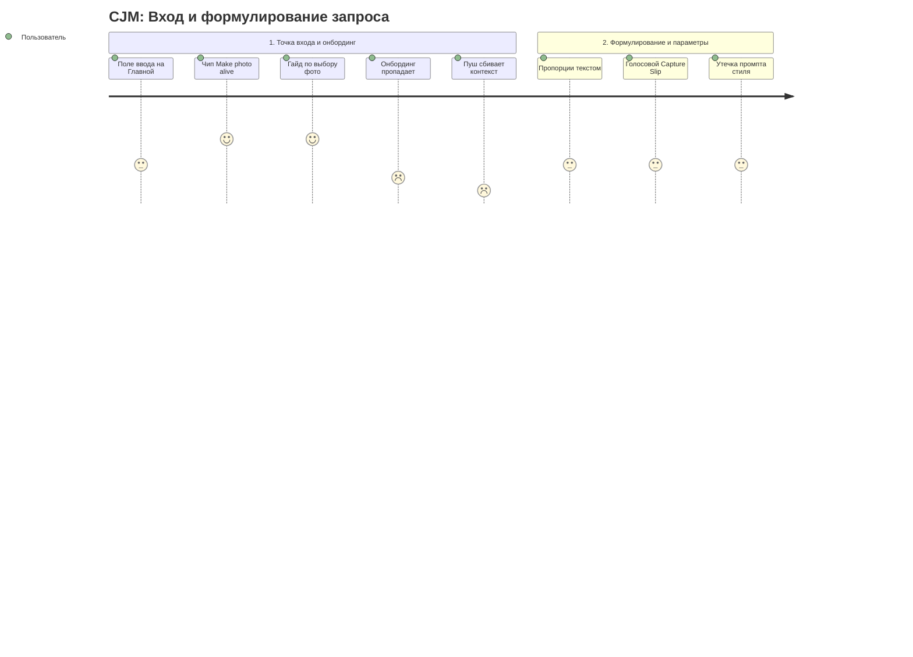

#### 2.1.2. Генерация и просмотр результата

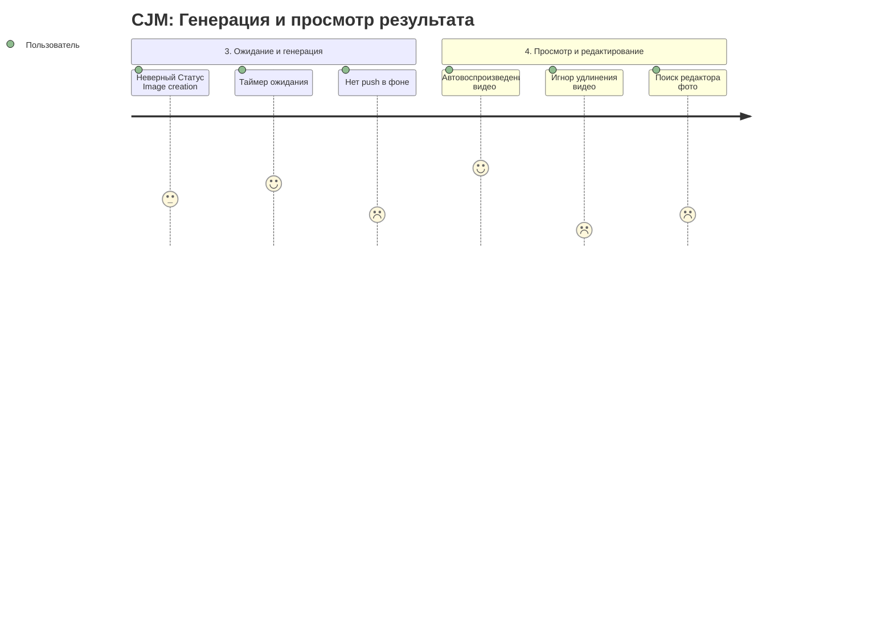

#### 2.1.3. Экспорт и повторный доступ

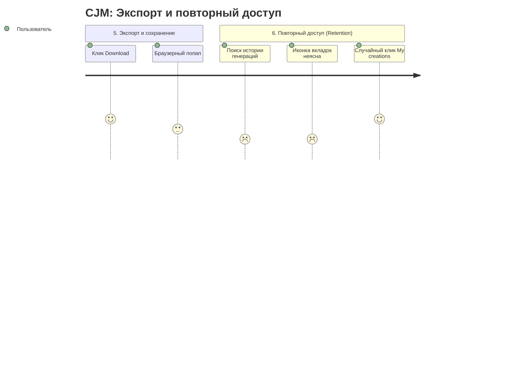

---

### 2.2. Сводная матрица пользовательского сценария (CJM Matrix)

| Этап сценария | Действие пользователя | Ментальная модель и ожидания | Реальность в интерфейсе Yandex AI | Оценка | Точки трения и барьеры | Ключевой вектор улучшения |
| :--- | :--- | :--- | :--- | :---: | :--- | :--- |
| **1. Вход и инициация** | Открывает приложение, видит Home Screen с новостной лентой и поисковой строкой. | «Хочу сгенерировать иллюстрацию или оживить снимок». | Единый омнибокс без селектора режимов («Ask anything or type url»); на баннерах доступен навык «Make photo alive». | **4/5**  | Конфликт браузерного и генеративного сценариев; нет явного разграничения режимов. | Сегментированный переключатель: `[Чат] [Арт] [Видео]` прямо в омнибоксе. |
| **2. Онбординг** | Знакомится с правилами выбора снимков. | «Понять требования к качеству и композиции». | Отличный гайд с примерами, но при случайном сворачивании приложения он бесследно исчезает. | **4/5**  | Баг сохранения состояния онбординга; потеря инструкций при переключении задач. | Кэширование состояния онбординга + шорткат вызова справки в заголовке. |
| **3. Настройка параметров** | Хочет задать соотношение 16:9 и выбрать художественный стиль. | «Выберу пропорцию и стиль одним тапом по кнопке/чипу». | Сенсорный ввод текста: `Draw ... 16:9 aspect ratio, 4 options`. Нет графических контролов. | **3/5**  | Лишние десятки тапов, опечатки, риск неправильного парсинга текста бэкендом. | Панель быстрых параметров: чипы `[1:1] [16:9] [9:16]`, карусель стилей. |
| **4. Выбор стиля в I2V** | Нажимает «Change style» и выбирает стиль (например, *Unicorn*). | «Стиль применится как фильтр к моему снимку». | Весь системный технический промпт вываливается в поле ввода, а миниатюра фото исчезает. | **2/5**  | **Утечка промпта (Prompt Leakage):** пользователь думает, что файл открепился или произошел сбой. | Инкапсуляция промпта в UI-тег `[🦄 Unicorn]`; сохранение превью фото над инпутом. |
| **5. Голосовой ввод** | Диктует длинный художественный сюжет через микрофон. | «Проверю распознанный текст, исправлю термины и отправлю». | При отпускании микрофона / тапе по стрелке запрос сразу отправляется в чат без предпросмотра. | **2/5**  | **Capture Slip:** слова с опечатками уходят в генерацию, расходуя время и лимиты. | Буфер валидации: распознанный текст остается в поле ввода для ручной правки. |
| **6. Ожидание генерации** | Ждет готовности медиафайла. | «Видеть прогресс и получить уведомление, если свернул экран». | Работает динамическая анимация с таймером, но при выходе из приложения push-уведомление не приходит. При запросе видео пишется «Image creation». | **4/5**  | Дезинформация о типе медиа («image» вместо «video»); риск забыть о задаче при уходе в фон. | Корректный статус «Video creation»; push-уведомление по готовности рендера. |
| **7. Оценка и итерация видео** | Видит 4-секундный ролик, просит сделать его длиннее / реализовать сложный сценарий. | «Модель расширит ролик до 8–10 секунд или честно скажет о лимите». | Модель молча обрезает сложный сюжет до 4 секунд, а на просьбу удлинить видео не реагирует. | **1/5**  | Игнорирование просьбы; иллюзия поломки ассистента; отсутствие предиктора длительности. | LLM-интерцептор: предупреждение о 4-секундном лимите до генерации; сплит промпта. |
| **8. Экспорт** | Нажимает кнопку «Download» под результатом. | «Файл мгновенно сохранится в галерею смартфона». | Всплывает веб-диалог Chromium: *«Download video_...mp4 from yandex.com.tr?»*. | **4/5**  | Разрыв нативного UX; лишний подтверждающий шаг; страх небезопасной веб-загрузки. | Нативное сохранение через MediaStore API в системный альбом `Галерея -> Yandex AI`. |
| **9. Повторный доступ** | Хочет найти вчерашние арты и видеоролики. | «Открою Профиль или вкладку "Моя галерея" на Главной». | Раздел «My creations» запрятан внутри модального окна навыка «Make photo alive». | **2/5**  | Архитектурный тупик: нулевая находимость галереи; путаница между вкладками браузера и чатами. | Вынос кнопки **«Моя галерея»** на главный экран и в меню профиля; понятная иконка чатов. |

---

## 3. Сильные стороны сценария (Что уже работает на высшем уровне)

Перед детальным разбором дефектов зафиксируем ключевые инженерные и продуктовые успехи текущей реализации Yandex AI:

1. **Контекст диалога не теряется между шагами:**
   Бэкенд уверенно держит контекст сессии. Если после генерации статичного изображения отправить команду `make this photo alive`, система безошибочно связывает реплику с предыдущим артом и начинает генерацию видеоролика без повторной загрузки файла.
2. **Понятно, что приложение сейчас работает:**
   При генерации изображений и видео показывается фирменная анимация с таймером обратного отсчета. Пользователь видит, что процесс идёт, и не думает, что приложение зависло.
3. **Качественный обучающий контент («Your photo choice matters»):**
   Экран подготовки к анимации фото даёт наглядные и лаконичные рекомендации: фокус на лицах, чёткое освещение, нейтральный фон. Это хорошо снижает число ошибок ещё до того, как пользователь их совершит.
4. **Нативный просмотр и интерактивность:**
   Готовое видео автоматически начинает воспроизводиться в ленте, по одиночному тапу открываются нативные контролы видеоплеера, а статичные арты поддерживают плавное жестовое масштабирование (pinch-to-zoom).

---

## 4. Глубокий аудит слабых точек сценария: 15 ключевых проблем

Все проблемы упорядочены по функциональным кластерам, проанализированы через призму эвристик Нильсена, таксономии человеческих ошибок Нормана/Ризона и проиллюстрированы конкретными скриншотами.

```
                     ┌─────────────────────────────────────────────────────────┐
                     │          15 Выявленных дефектов взаимодействия          │
                     └────────────────────────────┬────────────────────────────┘
                                                  │
         ┌────────────────────┬───────────────────┴───────────────────┬────────────────────┐
         ▼                    ▼                                       ▼                    ▼
  [ Кластер 1 ]        [ Кластер 2 ]                           [ Кластер 3 ]        [ Кластер 4 ]
  Архитектура и        Промптинг и                             Логика видео и       Экспорт и
  навигация            контролы ввода                          обратная связь       интеграция
  (Проблемы 4,5,6,     (Проблемы 10, 11,                       (Проблемы 1, 2,      (Проблема 12)
   7, 8, 9)             13, 15)                                 3, 14)
```

---

### КЛАСТЕР 1: Архитектурные барьеры и навигационные ловушки

---

#### Проблема №8: Запрятанный хаб «My creations» внутри навыка анимации фото
* **Проявление:** Галерея сгенерированных пользователем работ («My creations»), где собраны все результаты (и фото, и видео) с исходными промптами, полностью изолирована внутри модального окна навыка «Make photo alive». На Главном экране, в боковом меню и в профиле точки входа в галерею отсутствуют.  

| Эвристика Нильсена | Тип ошибки (Норман/Ризон) | Критичность (NNG) |
| :--- | :--- | :---: |
| #6 Recognition rather than recall, #7 Flexibility and efficiency of use | Knowledge-based Mistake & Gulf of Evaluation | 3 (Major) |

* **Скриншоты:**
  * `./screenshots/Screenshot_20260908-213743_yandexai.png` — Главный экран без намека на галерею работ.
  * `./screenshots/Screenshot_20260908-213755_yandexai.png` — Сама галерея «My creations», открывающаяся только через «Make photo alive».
  * `./screenshots/Screenshot_20260908-213910_yandexai.png` — Детальное меню элемента в галерее с кнопками копирования промпта и удаления.

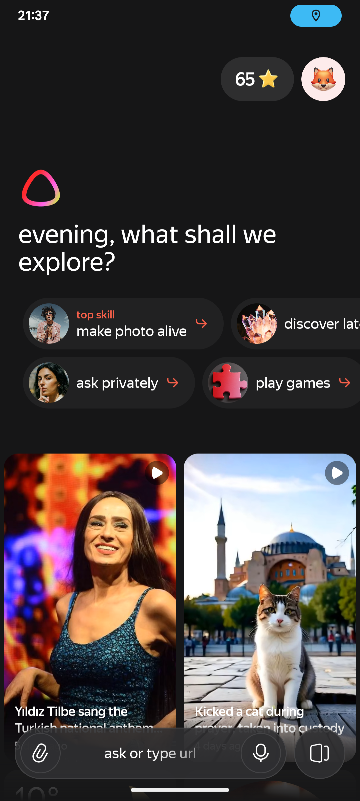
*Рисунок 1. Главный экран без намека на галерею работ*

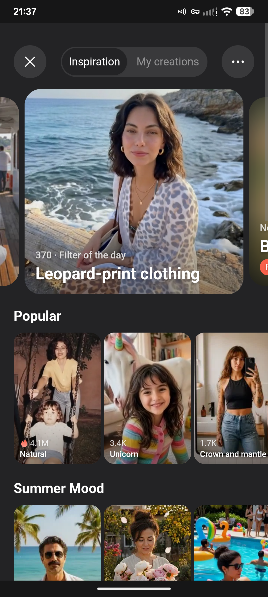
*Рисунок 2. Сама галерея «My creations», открывающаяся только через «Make photo alive».*

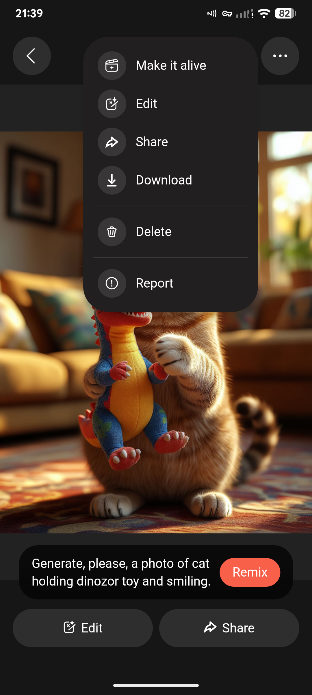
*Рисунок 3. Детальное меню элемента в галерее с кнопками копирования промпта и удаления. P.S. Также тут два меню управления дублирующихся, я бы перенёс меню из кнопки "..." вниз, поставив стрелочку, раскрывающую все доступные функции*

* **Когнитивный анализ:** Пользователь формирует ментальную цель: *«Найти сгенерированную вчера картинку и скопировать промпт»*. Он ищет разделы «Профиль», «Галерея» или «История генераций». Глагол *«Оживить фото»* в ментальной модели никак не связан с поиском статичного рисунка, созданного в текстовом диалоге. Фича с высокой ценностью для Retention оказывается скрытой для подавляющего большинства пользователей, не знакомых с навыком «Make photo alive».
* **Решение:** Вынести постоянную кнопку/чип **«Моя галерея» (My Creations)** на Главный экран в блок быстрых действий и продублировать ее в боковом меню профиля.

---

#### Проблема №7: Погребенный сценарий редактирования и генерации фотографий
* **Проявление:** Если пользователь хочет просто отредактировать фотографию (например, подготовить новую стилизованную аватарку для мессенджера без видео-анимации), он не находит понятной точки входа. Инструмент редактирования фото спрятан в самом конце карусели «Make photo alive» либо глубоко в шторке прикрепления вложений.

| Эвристика Нильсена | Тип ошибки (Норман/Ризон) | Критичность (NNG) |
| :--- | :--- | :---: |
| #6 Recognition rather than recall, #8 Aesthetic and minimalist design | Mode Error (пользователь не понимает, в каком режиме находится инструмент) | 3 (Major) |

* **Скриншоты:**
  * `./screenshots/screen_47_attachment_sheet.png` — Шторка вложений со смешанными действиями.
  * `./screenshots/Screenshot_20260908-214856_yandexai.png` — Раздел с генерацией фотографий, спрятанный в конце скилла "Make photo alive".

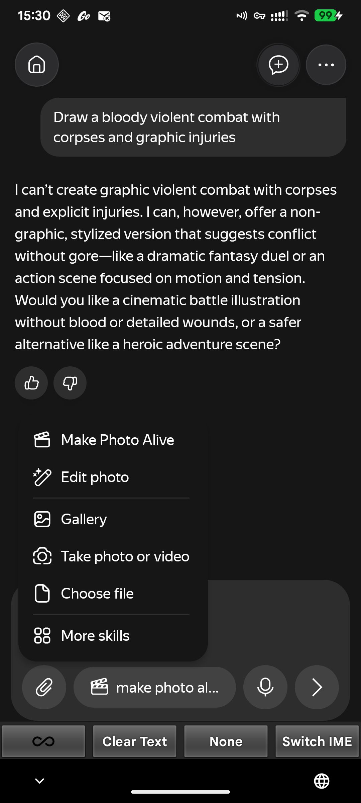
*Рисунок 1. Меню вложений скрывает инструмент стилизации и обработки фото.*


*Рисунок 2. Раздел с генерацией фотографий, спрятанный в конце скилла "Make photo alive".*

* **Когнитивный анализ:** Название навыка «Make photo alive» эксплицитно обещает движение (видео). Помещение функциональности статичной обработки фото (I2I / фильтрация) внутрь видео-инструмента создает когнитивное противоречие. Пользователи, которым не нужно видео, уходят искать сторонние фоторедакторы.
* **Решение:** Переименовать объединенный раздел в **«Генерация и редактор медиа»** с явным разделением на две вкладки: `[ 📸 Фото и аватарки ]` и `[ 🎬 Оживление в видео ]`, либо вынести инструмент «Редактор фото» отдельным чипом.

---

#### Проблема №9: Неочевидная иконка истории чатов (иконка браузерных вкладок)
* **Проявление:** Архив предыдущих чатов скрыт за кнопкой с иконкой квадратов(обозначающая вкладки браузерные?). Пользователи не считывают эту иконку как доступ к истории переписки с AI.

| Эвристика Нильсена | Тип ошибки (Норман/Ризон) | Критичность (NNG) |
| :--- | :--- | :---: |
| #4 Consistency and standards, #6 Recognition rather than recall | Description Slip (ассоциация иконки со вкладками веб-страниц) | 2 (Minor) |

* **Скриншоты:**
  * `./screenshots/Screenshot_20260908-213743_yandexai.png` — Главный экран со странной иконкой вкладок.


*Рисунок 1. Главный экран без намека на галерею работ*

* **Когнитивный анализ:** Пользователи мобильных мессенджеров и AI-ассистентов (ChatGPT, Claude, Telegram) привыкли к метафорам «гамбургер-меню слева», «часы со стрелкой» или значку диалогового списка. Метафора «счетчик открытых вкладок браузера» (например, `[2]`) заставляет думать, что клик откроет браузерные веб-страницы или перезагрузит текущую сессию.
* **Решение:** Заменить пиктограмму вкладок на стандартную иконку истории диалогов (список сообщений или часики) с текстовым тултипом / бейджем при первом входе.

---

#### Проблема №4: Онбординг ведет в чат с «проблемой белого листа» и перегруженной кнопкой
* **Проявление:** Обучающий сценарий онбординга ориентирует пользователя использовать интерфейс чата для оживления фото. В чате пользователь сталкивается с «проблемой белого листа» (пустой омнибокс). При этом кнопка-пилюля «Make photo alive» внутри чата занимает слишком много горизонтального места, а длинный текст на ней обрезается или перегружает строку ввода.

| Эвристика Нильсена | Тип ошибки (Норман/Ризон) | Критичность (NNG) |
| :--- | :--- | :---: |
| #8 Aesthetic and minimalist design, #6 Recognition rather than recall | Knowledge-based Mistake (новичок не знает, что напечатать в чате) | 3 (Major) |

* **Скриншоты:**
  * `./screenshots/screen_01_init.png` — Перегруженный инпут чата с массивной кнопкой навыка.
  * `./screenshots/screen_06_make_photo_alive.png` — Гораздо более удобная и наглядная визуальная галерея стилей «Inspiration».
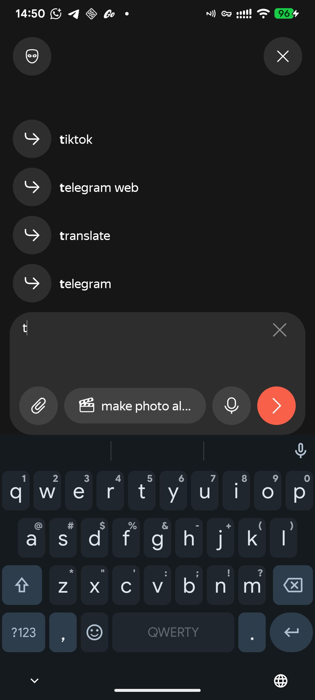
*Рисунок 1. Перегруженный инпут чата с массивной кнопкой навыка.*

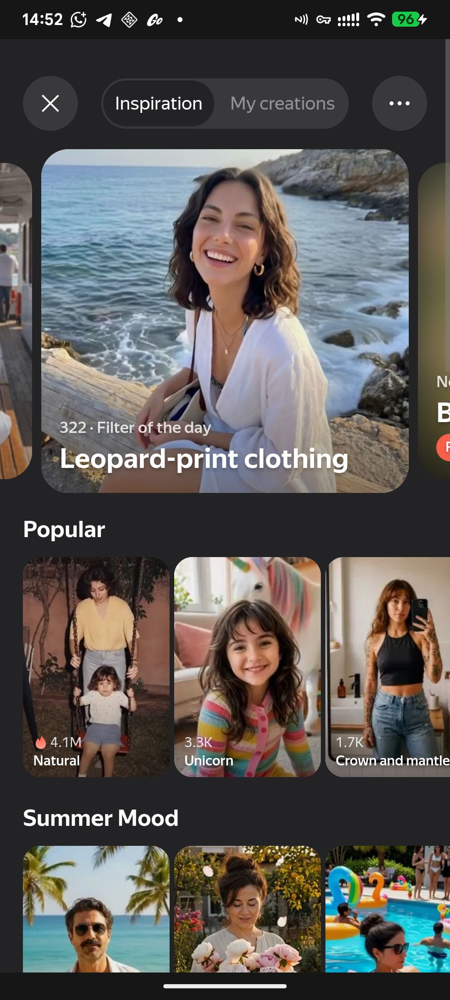
*Рисунок 2. Визуальная витрина фильтров «Inspiration» значительно понятнее новичкам, чем пустой чат.*

* **Когнитивный анализ:** Пользователь, пришедший за быстрым вау-эффектом, оказывается в командной строке. Визуальная вкладка с карточками фильтров («Inspiration») интуитивно понятнее на порядок: там есть крупные примеры до/после и готовые пресеты.
* **Решение:** Направлять пользователя из онбординга сразу на интерактивную визуальную витрину пресетов (экран «Inspiration»), а в чате заменить громоздкую текстовую кнопку на компактную иконку хлопушки `[ 🎬 ]` с аккуратным бейджем.

---

#### Проблема №5: Исчезновение онбординга при сворачивании приложения
* **Проявление:** Если пользователь во время прохождения обучающего гайда по анимации фото отвлекся (например, ответил на звонок или смахнул приложение в диспетчер задач), при повторном открытии онбординг бесследно пропадает, оставляя пользователя один на один с лентой и адресной строкой.

| Эвристика Нильсена | Тип ошибки (Норман/Ризон) | Критичность (NNG) |
| :--- | :--- | :---: |
| #3 User control and freedom, #5 Error prevention | Lapse / Memory Loss системы (потеря состояния активности) | 2 (Minor) |

* **Когнитивный анализ:** Прерывание сценария на мобильном устройстве — штатное поведение (входящие уведомления, звонки, переключение фокуса). Потеря обучающего контекста вызывает чувство растерянности и невозможность восстановить подсказки.
* **Решение:** Сохранять состояние онбординга в локальном хранилище (`Shared Preferences / DataStore`) и добавить в настройки / меню чата пункт **«Пройти обучение заново»**.

---

#### Проблема №6: Сбивание контекста генерации при клике на пуш бонусов (Лиги)
- Демонстрация: смотреть видео: [тык](https://disk.360.yandex.ru/i/_3uGT5fZ1RlwsA)
* **Проявление:** Во время активной сессии генерации медиа пользователю приходит попап-уведомление о начислении игровых бонусов (звезд Лиги Яндекса). Тап по уведомлению не открывает шторку или модальное окно поверх, а жестко перенаправляет экран на страницу бонусов, сбрасывая текущий диалог и контекст генерации. При возврате назад происходит возврат на главный экран, а не на чат.

| Эвристика Нильсена | Тип ошибки (Норман/Ризон) | Критичность (NNG) |
| :--- | :--- | :---: |
| #3 User control and freedom, #4 Consistency and standards | Mode / Interruption Slip | 4 (Blocker) |

* **Когнитивный анализ:** Пользователь ожидает, что системный пуш либо откроет всплывающий диалог с наградой, либо хотя бы не уничтожит стек навигации активного чата. На практике вернуться в прежний чат кнопкой «назад» не получается вовсе — восстановить сессию можно только через полный перезапуск приложения, то есть штатных средств для завершения начатой задачи в интерфейсе просто нет.
* **Решение:** Пофиксить deep link роутер: открывать экран бонусов как дочерний оверлей без разрушения контекста сессии.

---

### КЛАСТЕР 2: Формирование промпта и контролы ввода

---

#### Проблема №15: Утечка системного промпта при выборе стиля (Prompt Leakage)
* **Проявление:** При нажатии кнопки «Change style» и выборе любого художественного стиля (например, «Unicorn») система:
  1. Выгружает весь промпт для редактирования на английском языке прямо в поле ввода пользователя:
     ```text
     Make photo alive: show a unicorn running into the frame with 100% opacity, bright white background, realistic hair motion...
     ```
  2. **Не отображает миниатюру прикрепленного медиафайла** над строкой ввода.

| Эвристика Нильсена | Тип ошибки (Норман/Ризон) | Критичность (NNG) |
| :--- | :--- | :---: |
| #2 Match between system and the real world, #1 Visibility of system status | Description-Similarity Slip | 3 (Major) |

* **Скриншоты:**
  * `./screenshots/screen_12_change_style.png` — Экран выбора стиля (Unicorn, Steampunk и др.).
  * `./screenshots/screen_13_after_select_unicorn.png` — Утечка системного промпта в омнибокс и пропажа фото.

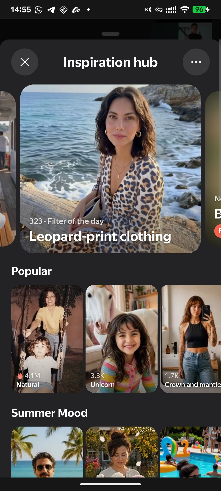
*Рисунок 1. Пользователь выбирает художественный стиль в аккуратном визуальном интерфейсе.*

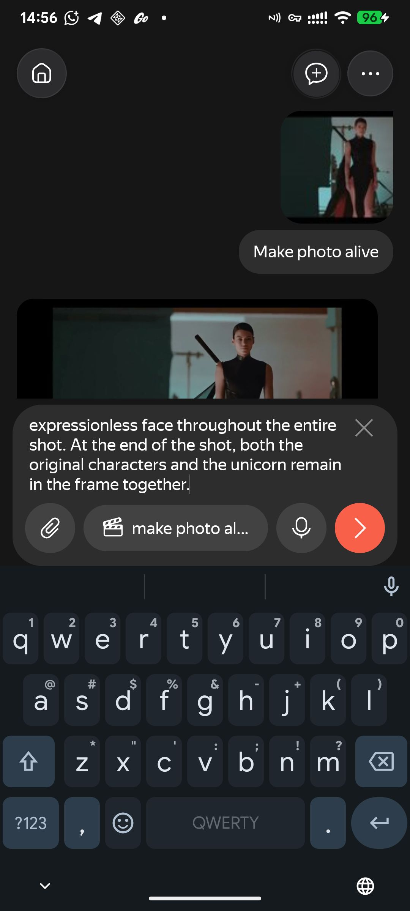
*Рисунок 2. Результат выбора стиля: омнибокс залит машинным английским текстом, а превью исходного снимка пропало.*

* **Когнитивный анализ:** Пользователь видит простыню непонятного английского технического текста и пустую область вложений. Возникает паника: *«Мое фото удалилось? Приложение сломалось? Нужно ли мне стереть этот текст или нажимать "Отправить"?»*. Часть пользователей стирает текст или закрывает экран, не решаясь отправить непонятный запрос, — сценарий генерации срывается, хотя технически отправка всё ещё возможна.
* **Решение:** Системные директивы для диффузионной модели передавать строго в скрытых метаданных API. В строке ввода отображать только компактный визуальный тег `[ 🦄 Unicorn  ✕ ]`, сохраняя миниатюру прикрепленного файла над полем.

---

#### Проблема №13: Отсутствие графических UI-контролов для параметров изображения
* **Проявление:** Для получения изображения в нужной ориентации (например, горизонтального кадра для презентации или обоев 16:9) или генерации нескольких версий пользователь вынужден вручную печатать на экранной клавиатуре смартфона: `Draw a sunset ... 16:9 aspect ratio, generate 4 options`. P.S. Генерации нескольких изображений нет, это игнорируется моделью, и так же не помечается как [ошибка](#проблема-3-25-игнорирование-запросов-на-увеличение-длительности-видео)

| Эвристика Нильсена | Тип ошибки (Норман/Ризон) | Критичность (NNG) |
| :--- | :--- | :---: |
| #2 Match between system and real world, #7 Flexibility and efficiency of use | Rule-based Mistake (необходимость угадывать поддерживаемый формат параметров) | 3 (Major) |

* **Скриншоты:**
  * `./screenshots/screen_29_omnibox_open.png` — Пустая клавиатура и поле ввода без контролов параметров.
  * `./screenshots/Screenshot_20260908-222021_yandexai.png` — Текстовый промпт со всеми параметрами в одной строке.

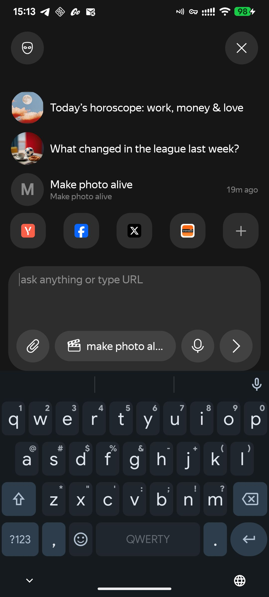
*Рисунок 1. Пользователь вынужден вручную набирать служебные инструкции на клавиатуре.*
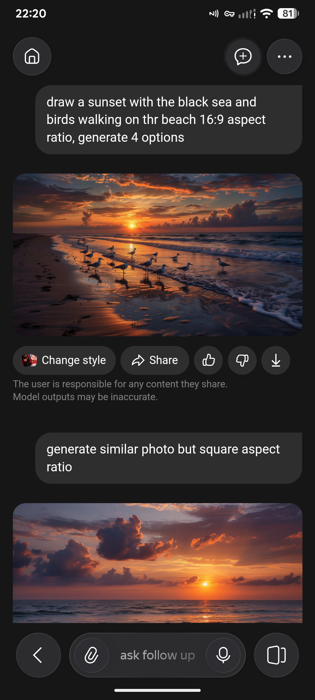
*Рисунок 1. Пользователь вынужден вручную набирать служебные инструкции на клавиатуре.*

* **Когнитивный анализ:**
  * **Закон Фиттса:** Выбор пропорции нажатием на чип `[ 16:9 ]` занимает **300 мс** и 1 тап. Набор фразы `16:9 aspect ratio` на сенсорной клавиатуре требует **22–25 тапов** и занимает **6–8 секунд**.
  * **Риск опечаток (Slips):** Пользователи пишут *«16 на 9»*, *«широкий формат»*, *«горизонтально»*, что часто не распознается парсером и приводит к генерации нежелательного квадратного кадра (1:1).
* **Решение:** Внедрить шторку быстрых параметров над клавиатурой при вводе визуального запроса: чипы пропорций `[ 1:1 ] [ 16:9 ] [ 9:16 ]` и селектор количества вариантов `[ 1 ] [ 2 ] [ 4 ]`.

---

#### Проблема №10: Ошибка захвата (Capture Slip) при голосовом вводе
* **Проявление:** При диктовке сложного художественного промпта через иконку микрофона распознанный системой текст автоматически и мгновенно отправляется в чат в момент отпускания кнопки / тапа по стрелке без возможности предварительно просмотреть и отредактировать результат распознавания речи.

| Эвристика Нильсена | Тип ошибки (Норман/Ризон) | Критичность (NNG) |
| :--- | :--- | :---: |
| #5 Error prevention, #3 User control and freedom | Capture Slip (автоматическая отправка сырого ввода) | 3 (Major) |

* **Когнитивный анализ:** Художественные промпты насыщены сложными авторскими терминами (названия стилей, имена художников, технические свойства оптики, пропорции). Распознавание речи часто делает мелкие фонетические искажения. Мгновенная отправка приводит к запуску дорогостоящей генерации заведомо испорченного промпта, вызывая досаду и трату времени пользователя.
* **Решение:** Перевести голосовой ввод в режим **буфера предпросмотра**: расшифрованный текст подставляется в строку ввода, курсор встает в конец строки, а пользователь может глазами проверить текст, внести правки и осознанно нажать кнопку «Отправить».

---

#### Проблема №11: Пассивный отказ модерации без кликабельных вариантов
* **Проявление:** Если запрос затрагивает чувствительную тему (правила безопасности контента), ассистент вежливо отказывает в генерации и текстом предлагает альтернативные безопасные сюжеты, но не предоставляет ни одного интерактивного действия.

| Эвристика Нильсена | Тип ошибки (Норман/Ризон) | Критичность (NNG) |
| :--- | :--- | :---: |
| #9 Help users recognize, diagnose, and recover from errors | Gulf of Execution (разрыв между рекомендацией и возможностью действия) | 2 (Minor) |

* **Скриншоты:**
  * `./screenshots/screen_44_moderation_prompt.png` — Запрос на генерацию боевой сцены и  текстовый отказ модерации с предложением безопасных тем.

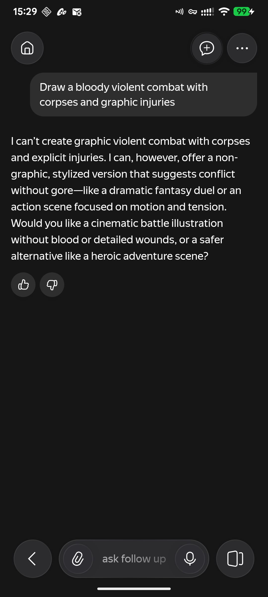
*Рисунок 8. Ассистент предлагает хорошие альтернативы в тексте, но заставляет пользователя вручную набирать их заново.*

* **Когнитивный анализ:** Ассистент пишет: *«I can offer a non-graphic, stylized version... like a dramatic fantasy duel or an action scene. Would you like a cinematic battle illustration...»*. Но в интерфейсе нет кнопок! Пользователь должен выделить текст, скопировать фразу ассистента или вручную перепечатывать длинное английское предложение. Часть пользователей на этом моменте просто закрывает чат.
* **Решение:** Реализовать **Action Chips (Интерактивные чипы восстановления)** под сообщением ассистента:
  `[ ⚔️ Фэнтези-дуэль без жестокости ]` `[ 🎬 Кинематографичный экшен ]` `[ ✏️ Изменить мой запрос ]`. Одиночный тап мгновенно перезапускает генерацию с безопасным промптом.

---

### КЛАСТЕР 3: Логика видеогенерации и обратная связь системы

---

#### Проблема №1: Некорректный системный статус «Image creation» при запросе видео
* **Проявление:** Когда пользователь запускает создание анимации или оживление фото, в статусной строке индикатора ожидания появляется лейбл **«Image creation»** (создание изображения) вместо «Video creation» (создание видео).

| Эвристика Нильсена | Тип ошибки (Норман/Ризон) | Критичность (NNG) |
| :--- | :--- | :---: |
| #1 Visibility of system status, #2 Match between system and the real world | Mode Confusion (система транслирует не тот режим) | 2 (Minor) |

* **Демонстрация:**
  * смотреть видео: [тык](https://disk.360.yandex.ru/i/puWu1lyZZu4MhQ)
* **Когнитивный анализ:** Пользователь запрашивал видеоролик, но видит сообщение о создании статичной картинки. Возникает ощущение, что модель не поняла команду и генерирует ненужный дубликат фото. Пользователь может отменить операцию или отправить повторный запрос.
* **Решение:** Синхронизировать UI-индикатор с типом задачи: отображать **«Video creation...»** или **«Оживляем ваше фото...»** с релевантной иконкой видеопленки.

---

#### Проблема №2: Скрытый 4-секундный лимит видео и обрезка сложного сценария
- Демонстрация: смотреть видео: [тык](https://disk.360.yandex.ru/i/sRX6M49RT6h-Ng)
* **Проявление:** Если пользователь пишет подробный сюжетный промпт для анимации (с чередой событий, развивающихся во времени), модель YandexART генерирует ролик строго фиксированной длительности (4 секунды) и успевает визуализировать только крошечную начальную часть запроса, просто отбрасывая остальной сценарий без предупреждения. Тот же паттерн молчаливого урезания возможностей наблюдается и со звуком: по отзывам пользователей, готовое видео генерируется без аудиодорожки, и модель никак не предупреждает, что добавить звук к ролику не может — пользователь узнает об этом только по факту, открыв результат.

| Эвристика Нильсена | Тип ошибки (Норман/Ризон) | Критичность (NNG) |
| :--- | :--- | :---: |
| #1 Visibility of system status, #5 Error prevention | Knowledge-based Mistake (незнание аппаратно-программных лимитов модели) | 3 (Major) |

* **Когнитивный анализ:** Пользователь тратит несколько минут на составление детального описания динамической сцены. На выходе он получает короткий зацикленный 4-секундный клип без звука, в котором сюжет обрывается на первом же действии. Чувство фрустрации усугубляется отсутствием объяснений, почему часть промпта (длительность, аудио) была проигнорирована.
* **Решение:**
  1. Внедрить **предиктор ограничений сценария**: перед запуском анализировать промпт через LLM и, если сюжет явно требует больше 4 секунд или явно предполагает звук/диалоги, выдавать предупреждение: *«Видеомодель создает ролики длительностью до 4 секунд и без звука. Ваш сюжет будет сокращен до первой сцены. [Сгенерировать 4 сек]  [Отредактировать]»*.
  2. В долгосрочной перспективе: алгоритм сплита промпта на 2–3 последовательных шота с последующей автосклейкой видеоряда и озвучкой.

---

#### Проблема №3 (2.5): Игнорирование запросов на увеличение длительности видео
* **Проявление:** Когда пользователь видит короткий ролик и пишет в чат: *«Сделай видео длиннее»* или *«Продли до 10 секунд»*, система молча перенаправляет запрос на генерацию нового 4-секундного видео, полностью игнорируя инструкцию по хронометражу.

| Эвристика Нильсена | Тип ошибки (Норман/Ризон) | Критичность (NNG) |
| :--- | :--- | :---: |
| #2 Match between system and real world, #9 Help users recognize, diagnose, and recover from errors | Rule-based Mistake (модель имитирует послушание, но не способна выполнить команду) | 4 (Blocker) |

* **Когнитивный анализ:** Создается эффект «глухого ассистента», который делает вид, что выполняет просьбу, но выдает тот же 4-секундный результат. У пользователя возникает устойчивое ощущение технического сбоя или глупости модели. При этом задача «получить более длинное видео» нативно в приложении невыполнима вообще — единственный обходной путь — генерировать несколько коротких клипов и склеивать их вручную в стороннем видеоредакторе, то есть штатными средствами приложения запрос не может быть выполнен.
* **Решение:** Запрос перед отправкой в видеогенератор должен проходить валидацию диалоговой LLM. Ассистент обязан честно и прозрачно ответить в чате: *«К сожалению, сейчас я умею создавать видео длительностью только до 4 секунд. Я могу сделать для вас новый вариант с более динамичным движением в рамках этого времени?»*.

---

#### Проблема №14: Отсутствие push-уведомлений о завершении генерации
* **Проявление:** Рендеринг видеороликов занимает от 30 до 60 секунд. Если пользователь сворачивает приложение или переключается в другой мессенджер, push-уведомление о завершении не приходит сразу. UPD: уведомление о готовой генерации всё же пришло, но со значительной задержкой — спустя 15-30 минут.

| Эвристика Нильсена | Тип ошибки (Норман/Ризон) | Критичность (NNG) |
| :--- | :--- | :---: |
| #1 Visibility of system status, #7 Flexibility and efficiency of use | Lapse (пользователь забывает о запущенной задаче) | 2 (Minor) |

* **Когнитивный анализ:** Вынуждать пользователя непрерывно смотреть на экран рендера в течение минуты — антипаттерн мобильного UX. Свернув приложение, пользователь отвлекается на дела и забывает вернуться. В результате сгенерированный контент остается невостребованным.
* **Решение:** Реализовать отправку нативного фонового уведомления: *«🎨 Ваш ролик готов! Нажмите, чтобы посмотреть»* (по аналогии с мобильным приложением Claude).

---

### КЛАСТЕР 4: Экспорт и сохранение медиаконтента

---

#### Проблема №12: Браузерный диалог загрузки вместо нативного сохранения в галерею
* **Проявление:** При нажатии кнопки «Download» под готовым видеороликом или изображением на экран выводится стандартный браузерный попап:
  > *«Do you want to download video_2026-09-08_15_01_29.mp4 from yandex.com.tr? [Download without asking] [No] [Yes]»*

| Эвристика Нильсена | Тип ошибки (Норман/Ризон) | Критичность (NNG) |
| :--- | :--- | :---: |
| #4 Consistency and standards, #2 Match between system and real world | Mode Error (раскрытие веб-оболочки внутри мобильного приложения) | 2 (Minor) |

* **Скриншоты:**
  * `./screenshots/screen_18_download_clicked.png` — Всплывающее браузерное окно скачивания файла.
  * `./screenshots/screen_19_download_yes.png` — Подтверждение загрузки в системную папку Download.

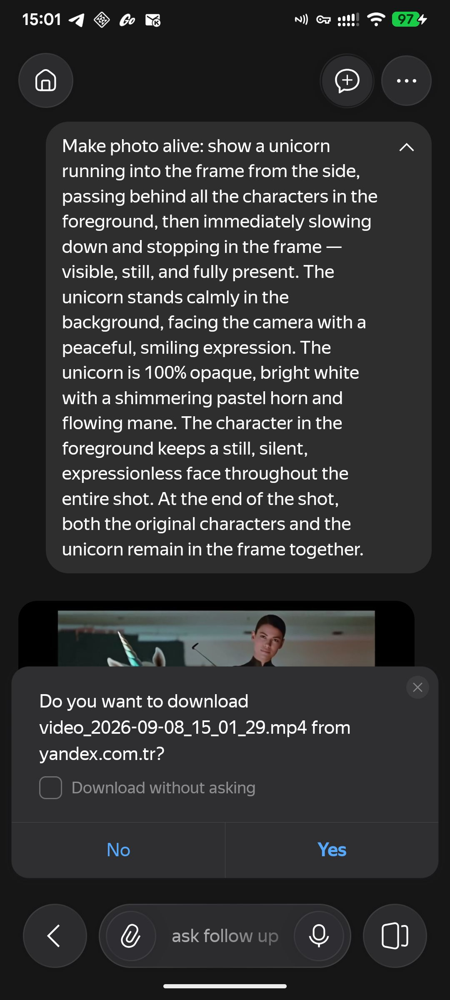
*Рисунок 9. Кнопка Download триггерит браузерный диалог загрузки со стороннего домена yandex.com.tr.*

* **Когнитивный анализ:** Пользователь находится в мобильном приложении и ожидает паттерн уровня Telegram, WhatsApp: медиафайл по кнопке «Скачать» мгновенно и тихо падает в системную Фотопленку/Галерею устройства. В случае с WhatsApp, медиафайлы вообще сразу появляются в галерее без дополнительного скачивания. Браузерный попап создает ощущение «дешевого веб-сайта в обертке WebView», пугает вопросами про скачивание файлов с неизвестного турецкого домена (`yandex.com.tr`) и требует лишнего подтверждающего тапа.
* **Решение:** Использовать нативный **Android MediaStore API** / iOS PhotoKit: прямое тихое сохранение файла в системный альбом `Галерея -> Yandex AI` с показом аккуратного системного Snackbar: *«Видео сохранено в галерею [Открыть]»*.

---

## 5. Дополнительные наблюдения по смежному контексту (Лента рекомендаций и сервисы)

Помимо основного сценария, я заодно прошёлся по соседним разделам приложения и нашёл дополнительные слабые места, влияющие на общее восприятие продукта:
* **Положительные стороны:**
  * Превосходная реализация ИИ-дайджестов новостей в видеоформате (лаконичная суммаризация новостей).
  * Интуитивно понятные виджеты и чипы сервисов экосистемы Алисы.
* **Зоны трения в ленте (Feed):**
  1. *Неочевидные иконки:* Ряд кнопок в ленте не имеет текстовых подписей, их назначение приходится выяснять методом проб и ошибок.
  2. *Смешение категорий:* В едином потоке ленты перемешаны новости, финансы, развлекательные ролики и виджеты погоды. Желательно предоставить наглядные вкладки фильтрации тем на верхнем уровне.
  3. *Сбой рекомендаций при перелистывании видео:* При открытии ролика из ленты свайп вверх открывает не следующий ролик из текущей подборки Главного экрана, а уводит пользователя в бесконечный поток похожих видео, сбивая фокус первичного интереса.

---

## 6. Целевое проектное решение (To-Be Architecture & Wireframes)

### 6.1. Сравнительная матрица изменений: As-Is vs. To-Be

| Параметр взаимодействия | Текущее состояние (As-Is) | Целевое решение (To-Be) | Ожидаемый эффект для продукта |
| :--- | :--- | :--- | :--- |
| **Точка входа в генерацию** | Скрыта в общем поле ввода; требует знания триггерных слов или поиска баннеров. | Сегментированный селектор в омнибоксе: `[ 💬 Чат ] [ 🎨 Арт ] [ 🎬 Видео ]`. | Заметное снижение барьера входа; устранение «проблемы белого листа». |
| **Параметры графики** | Ручной ввод текста на клавиатуре (*«16:9, 4 options»*). | Панель чипов над клавиатурой: пропорции `[1:1] [16:9] [9:16]` и стили. | Экономия 5–7 секунд на запрос; ликвидация опечаток (Закон Фиттса). |
| **Применение стиля (I2V)** | Утечка машинного системного промпта в поле ввода; исчезновение миниатюры фото. | Чип стиля `[ 🦄 Unicorn ✕ ]` в метаданных; превью фото всегда на экране. | Снижение риска паники и отказа от сценария (Severity 3 -> 0). |
| **Голосовой ввод промпта** | Мгновенная отправка сырого распознанного текста в чат. | Буфер валидации: текст вставляется в инпут для проверки и редактирования. | Предотвращение ошибочных дорогостоящих генераций (Severity 3 -> 0). |
| **Отказ модерации** | Пассивный текстовый отказ с советами безопасных сюжетов. | Интерактивные чипы: `[ ⚔️ Фэнтези без крови ]` `[ ✏️ Изменить ]`. | Более высокое удержание пользователей после срабатывания цензурного фильтра. |
| **Лимиты длительности и звука видео** | Модель молча режет промпт до 4 сек, игнорирует просьбы удлинить ролик и не предупреждает об отсутствии звука. | Предиктор ограничений: предупреждение до генерации + диалоговый ответ LLM. | Прозрачность ожиданий; устранение иллюзии «сломанного ассистента». |
| **Экспорт медиа** | Браузерный попап с вопросом про домен `yandex.com.tr`. | Нативное фоновое сохранение через MediaStore API в альбом смартфона. | Нативный премиальный UX; сокращение пути сохранения до 1 тапа. |
| **Доступ к истории работ** | Вкладка «My creations» запрятана внутри конкретного навыка «Make photo alive». | Постоянная кнопка **«Моя галерея»** на Главном экране и в меню профиля. | Рост повторных визитов и повторного шэринга сгенерированного контента. |

---

### 6.2. UI-иллюстрации ключевых экранов

#### 1. Главный экран: Быстрый доступ к галерее и медиарежимам
```
+-------------------------------------------------------------+
| [≡ Профиль]              Yandex AI             [🔔 Уведомл.]|
+-------------------------------------------------------------+
|  Быстрые инструменты/чипы действий:                         |
|  [ 🖼️ Моя галерея ]   [ 🎬 Оживить фото ]   [ 🎨 Создать арт ]|  <-- Новая точка входа!
+-------------------------------------------------------------+
|  [ 🔍 Спросите о чем угодно или создайте медиа...       🎤 ] |
+-------------------------------------------------------------+
|  Ваши недавние шедевры:                                     |
|  [ 🐱 Кот-стимпанк ]  [ 🦄 Единорог в лесу ]  [ Все (12) → ] |
+-------------------------------------------------------------+
|  Лента рекомендаций...                                      |
```

#### 2. Строка ввода: Чипы параметров и защита от утечки промпта
```
+-------------------------------------------------------------+
| Прикреплено: [ 🖼️ photo_portrait.jpg ✕ ]                     |
| Активный стиль: [ 🦄 Unicorn ✕ ]                             |  <-- Стиль инкапсулирован!
+-------------------------------------------------------------+
| Пропорции: [ 1:1 ] [ 16:9 ] [ 9:16 ]   Варианты: [ 1 ] [ 4 ] |  <-- Быстрые чипы параметров
+-------------------------------------------------------------+
| [ Опишите сюжет или детали анимации...                ] [ ↑ ]|
+-------------------------------------------------------------+
```

#### 3. Сообщение модерации с интерактивными чипами
```
+-------------------------------------------------------------+
| 🤖 Yandex AI:                                               |
| Я не могу создать изображение со сценами насилия, но могу   |
| предложить зрелищные альтернативные сюжеты:                 |
|                                                             |
| [ ⚔️ Эпическая фэнтези-дуэль ]                               |  <-- Кликабельный чип
| [ 🛡️ Кинематографичный экшен рыцарей ]                      |  <-- Кликабельный чип
| [ ✏️ Отредактировать мой запрос ]                            |  <-- Открыть инпут
+-------------------------------------------------------------+
```

#### 4. Экран готового результата с нативным сохранением
```
+-------------------------------------------------------------+
|  [ ▶ Видеоролик 0:04 ]  (Автовоспроизведение зациклено)     |
+-------------------------------------------------------------+
|  [ ⬇ Сохранить в галерею ]   [ 🔄 Другой стиль ]   [ ↗ Поделиться ] |
+-------------------------------------------------------------+
|  Snackbar:  ✓ Видео сохранено в «Галерея → Yandex AI»  [Открыть]   |
+-------------------------------------------------------------+
```

---

## 7. Приоритизация доработок и дорожная карта (Roadmap)

### 7.1. Матрица Impact vs. Effort

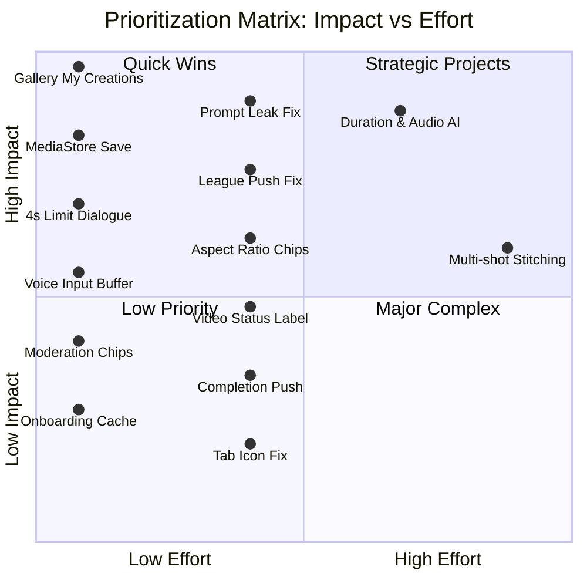

> [!NOTE]
> **Интерпретация квадрантов матрицы (Значимость vs Трудоемкость):**
> * **Quick Wins (Быстрые победы / Левый верхний угол):** Высокий эффект при низкой трудоемкости. Задачи первоочередного внедрения (P0) — вынос галереи *My creations* на Главный экран, устранение утечки промпта стиля, нативное сохранение через MediaStore, фикс deep-link роутера пушей Лиги, диалоговое объяснение лимита видео.
> * **Strategic Projects (Стратегические инициативы / Правый верхний угол):** Высокий эффект при высокой сложности реализации (P2) — ML-предиктор длительности и необходимости генерации аудио в сценарии, склейка нескольких видео и поддержка аудио.
> * **Major Complex / Low Priority (Нижние квадранты):** Задачи с меньшим удельным ROI или требующие отдельного продуктового пересмотра — здесь оказались доработки, которые удобны, но не блокируют выполнение основной задачи (иконка истории, попап скачивания, push о готовности).

---

### 7.2. Сводный реестр задач по уровням критичности

| Приоритет | ID | Наименование доработки | Затронутые эвристики | Трудоемкость | Бизнес-эффект |
| :---: | :---: | :--- | :---: | :---: | :--- |
| **P0** | **#8** | **Вынос «My creations» на Главный экран** | #6, #7 | Low (Frontend) | Ликвидация изоляции архива работ, рост повторных визитов. |
| **P0** | **#15** | **Инкапсуляция системного промпта стиля в чип** | #1, #2 | Low (Frontend) | Устранение паники пользователя и риска срыва генерации. |
| **P0** | **#12** | **Нативное сохранение видео через MediaStore** | #2, #4 | Low (Android API) | Ликвидация веб-диалога загрузки со стороннего домена, 1-тап сохранение. |
| **P0** | **#6** | **Фикс deep-link роутера пуш-уведомлений Лиги** | #3, #4 | Low (Routing) | Устранение сценария, где вернуться в прежний чат можно только перезапуском приложения. |
| **P0** | **#3** | **Диалоговое объяснение 4-секундного лимита видео и отсутствия звука** | #2, #9 | Low (LLM Prompt) | Устранение сценария, где нужный результат нативно недостижим без стороннего редактора. |
| **P1** | **#13** | **Графические чипы соотношения сторон и стилей** | #2, #7 | Medium (UI) | Ускорение ввода параметров по закону Фиттса, снижение опечаток. |
| **P1** | **#10** | **Буфер предпросмотра при голосовом вводе** | #3, #5 | Low (UI/STT) | Защита от ошибочных генераций при распознавании терминов. |
| **P1** | **#11** | **Action Chips при отказах модерации** | #9, #3 | Low (Prompt/UI) | Удержание пользователей в воронке диалога вместо сброса задачи. |
| **P1** | **#1** | **Корректный лейбл статуса «Video creation»** | #1, #2 | Very Low (Strings) | Устранение дезинформации о типе генерируемого контента. |
| **P1** | **#14** | **Push-уведомление о готовности медиа без задержки** | #1, #7 | Medium (Backend/FCM)| Более быстрый возврат пользователя в приложение после завершения рендера. |
| **P1** | **#4** | **Онбординг на витрину пресетов вместо чата** | #6, #8 | Medium (Routing) | Снятие проблемы белого листа для новых пользователей. |
| **P1** | **#5** | **Кэш состояния онбординга при сворачивании приложения** | #3, #5 | Medium (State) | Устранение потери обучающего контента при прерывании сессии. |
| **P1** | **#9** | **Замена браузерной иконки вкладок на иконку истории** | #4, #6 | Very Low (Asset) | Прозрачность навигации по старым диалогам. |
| **P2** | **#7** | **Выделенный раздел «Редактор фото / аватарок»** | #6, #8 | Medium (IA) | Привлечение аудитории, которой нужны статичные аватарки. |
| **P2** | **#2** | **Предиктор длительности, мультишот-склейка, поддержка генерации аудио** | #1, #5 | High (R&D/ML) | Возможность создания более длинных видеоисторий со звуком. |

---

### 7.3. Поэтапная дорожная карта внедрения (Phased Roadmap)

```
       Спринт 1–2 (Quick Wins / P0)           Месяц 1–2 (UX Foundation / P1)        Месяц 3–6 (Advanced AI / P2)
┌──────────────────────────────────────┐┌──────────────────────────────────────┐┌──────────────────────────────────────┐
│ • Вынос «My creations» на Главную    ││ • Панель чипов пропорций (16:9, 9:16)││ • Предиктор длительности и звука     │
│ • Скрытие системного промпта стиля   ││ • Интерактивные чипы модерации       ││ • Мультишотная генерация и склейка   │
│ • Нативное сохранение в Галерею      ││ • Push-уведомления без задержки      ││ • Выделенный редактор аватарок       │
│ • Фикс deep-link роутера пушей Лиги  ││ • Кэш состояния онбординга           ││ • Сквозная синхронизация черновиков  │
│ • Диалог про лимит видео вместо игнора││ • Замена иконки истории чатов       |│   между вебом и мобильным приложением│
│ • Буфер валидации голосового ввода   ││ • Замена текста «Image creation»     ││                                      │
└──────────────────────────────────────┘└──────────────────────────────────────┘└──────────────────────────────────────┘
```

---

## 8. Заключение

В основе мобильного приложения **Yandex AI** лежит сильное генеративное ядро: модели YandexART и алгоритмы анимации фото Шедеврума дают качественную картинку, надёжно держат диалоговый контекст и хорошо показывают прогресс во время рендера.

Однако в текущей версии потенциал продукта сдерживается тремя системными барьерами:
1. **Информационная изоляция:** ключевые возможности (полноценная галерея сгенерированных работ «My creations» и редактирование фото) спрятаны внутри модальных окон второстепенных навыков.
2. **Текстоцентричность интерфейса:** отсутствие специализированных графических контролов (чипов пропорций, визуальных стилей, буфера голосового ввода) заставляет пользователя работать в режиме архаичной командной строки, порождая опечатки и утечки системных промптов.
3. **Разрыв платформенных стандартов:** браузерные попапы скачивания со сторонних доменов и отсутствие фоновых push-уведомлений разрушают опыт нативного мобильного приложения.

Реализация первоочередного пакета изменений (**P0 / P1 Quick Wins**) закрывает именно те точки отвала, что зафиксированы в CJM (раздел 2.1) и разборе проблем (раздел 4): недостижимые нативно сценарии, потерю контекста сессии, скрытую галерею работ и барьеры ручного ввода параметров. Это не гарантия конкретных цифр без A/B-теста на реальных пользователях, но прямое устранение описанных в этом документе тупиков и источников фрустрации.
